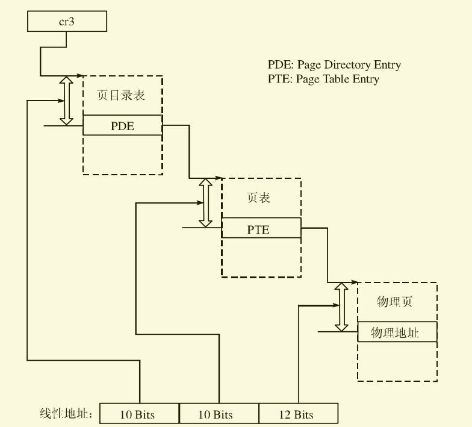

# 启动分页机制

​	这个概念想必在很多教科书上听得也不少了吧？现在我们就要让我们的操作系统也支持分页管理了！首先我们先看一下几个概念：

​	1.页

​	所谓的“页”，就是一块内存，在80386中（我们系统所处的平台），页的大小是固定的4096字节（4KB）。在其他平台可能不是，但我们不必理会。

​	2.逻辑地址、线性地址、物理地址

​	在之前我们一直用的都是分段机制，在分段机制中，我们给出的逻辑地址就可以通过段选择子找到的段和偏移得到真正的物理地址。

​	但如果我们使用了分页机制，以上的情况将会发生改变。分段机制先将逻辑地址转化为线性地址，线性地址再通过分页机制转换为物理地址。也即是：

​		逻辑地址 ----------[分段机制]----------> 线性地址 ----------[分页机制]----------> 物理地址 

​	（SEG:OFFSET）						

​	在这，你一定还是疑惑，我们为啥需要分页?

​	首先，虽然分段管理机制已经给我们提供了很好的保护机制，但是它还不够灵活，一个段一般用来存放比较大的内存单位。而分页后线性地址中的任意一个页都能映射到物理地址中的任何一个页，它相当的灵活，我们马上了解它的原理。

## 分页机制概述

​	很明显我们从上面的转换可以看出，三种地址的转换就像一个函数：

​		线性地址=f1(逻辑地址)		物理地址=f2(线性地址)

​	我们已经学习过分段机制，知道f1是怎么样的了，我们马上来学习f2吧，它的转换机制下图所示。



​	转换会使用到两级页表，第一级叫做页目录表，大小是固定的4KB，存储在一个物理页中，每个表项4字节，共有1024个表项，每一个表项对应一个二级的页表，第二级的每一个表项也有1024个表项，每一个表项对应物理页。页目录表的表项被称为PDE(Page Directory Entry)，页表的表项简称PTE(Page Table Entry)。

​	进行转换的时候，先从寄存器cr3指定的页目录中根据线性地址的高10位得到页表地址，就像是查字典一样，找到“陈”字的首字母C的汉字起始页。然后在去到页表中根据线性地址的中间10位得到物理页首地址，将这个首地址加上线性地址低12位便得到了物理地址，就像查字典，我们知道"陈"这个字在首字母C的汉字起始页的第56个字，就是一种偏移，然后我们只要按顺序找到第56个字就可以找到“陈”字了！

​	这样看来，分页机制好像也没什么了不起，我们为什么说它更灵活呢？很简单，我们可以个每个程序分配不同的线性地址，那么每个程序的cr3的值就不一样，程序不用知道里面的映射规则，只知道使用线性地址就可以了！可以让我们的系统完全包办地址转换，第三方程序只负责用就好了，用户开发体验贼好！

## PDE和PTE

​	我们马上看看PDE（4K页表）和PTE（4K页）的结构。

​	PDE：

.png)

​	PTE：

.png)

​	里面的基地址是我们首要关心的，里面的属性由于过多了，大家可以自行查阅Intel IA32开发手册或者其他资料查看哦。

## 编写代码

​	由于分页机制需要存放页目录表和页表（包含所有页表项），我们将页目录表放在1M内存地址处，页目录表占4KB，所以我们将页目录表挂载在1M ～1M + 4K处，32位系统最多只能看到4GB，那么4GB最多被 4GB / 4KB（一个页的大小） = 1048576个页表项表示，一个页表项占32位,即4字节，那么总共需要1048576 * 4 = 4194304字节 = 4096KB = 4M。所以我们的我们应该为所有硬件考虑，保留1M (0x100000)~ 5M + 4KB(0x501000)的这块内存个系统存放页目录表和页表，反正现在的硬件动不动4GB起步，我们就不考虑内存小于4G的内存浪费了，管他呢。

​	同时，为了简单起见，我们的分页将所有的线性地址映射到相同的物理地址，以后再考虑复杂的内存映射，于是物理地址和线性地址间的转换方式就是对等的了。

​		物理地址 = f(线性地址) = 线性地址

​	哈哈，这样看来我们的分页机制看起来就相当于没有意义了，但分页之后更灵活的虚拟内存管理也是一大亮点啊。

​	我们将页目录表和页表的两个挂载点的宏定义在了load.inc文件中，然后我们将启动分页机制的代码直接放出来，因为它编写起来很容易出BUG而且难以调试，大家好好看注释和以上的内容理解它吧。

```assembly
;============================================================================
;   启动分页机制
; 根据内存的大小来计算应初始化多少的PDE以及多少PTE，我们给每页分4K大小(32位操作系统一般分4K，Windows 32也是如此哦)
; 注意：页目录表存放在1M(0x100000)~1.4M处(0x101000)
;      所有页表存放在1.4M(0x101000)~5.4M处(0x501000)
;----------------------------------------------------------------------------
SetupPaging:
    xor edx, edx            ; edx = 0
    mov eax, [ddMemSize]    ; eax = 内存大小
    mov ebx, 0x400000       ; 0x400000 = 4M = 4096 * 1024，即一个页表对于的内存大小
    div ebx                 ; 内存大小 / 4M
    mov ecx, eax            ; ecx = 需要的页表的个数，即 PDE 应该的页数
    test edx, edx
    jz .no_remainder        ; if(edx == 0) jmp .no_remainder，没有余数
    inc ecx                 ; else ecx++，有余数则需要多一个 PDE 去映射它
.no_remainder:
    push ecx                ; 保存页表个数
    ; flyanx 0.11为了简化处理，所有线性地址对应相等的物理地址，并且暂不考虑内存空洞

    ; 首先初始化页目录
    mov ax, SelectorData
    mov es, ax
    mov edi, PAGE_DIR_BASE  ; edi = 页目录存放的首地址
    xor eax, eax
    ; eax = PDE，PG_P（该页存在）、PG_US_U（用户级页）、PG_RW_W（可读、写、执行）
    mov eax, PAGE_TABLE_BASE | PG_P | PG_US_U | PG_RW_W
.SetupPDE:  ; 设置 PDE
    stosd                   ; 将ds:eax中的一个dword内容拷贝到ds:edi中，填充页目录项结构
    add eax, 4096           ; 所有页表在内存中连续，PTE 的高20基地址指向下一个要映射的物理内存地址
    loop .SetupPDE           ; 直到ecx = 0，才退出循环，ecx是需要的页表个数

    ; 现在开始初始化所有页表
    pop eax                 ; 取出页表个数
    mov ebx, 1024           ; 每个页表可以存放 1024 个 PTE
    mul ebx                 ; 页表个数 * 1024，得到需要多少个PTE
    mov ecx, eax            ; eax = PTE个数，放在ecx里是因为准备开始循环设置 PTE
    mov edi, PAGE_TABLE_BASE; edi = 页表存放的首地址
    xor eax, eax
    ; eax = PTE，页表从物理地址 0 开始映射，所以0x0 | 后面的属性，该句可有可无，但是这样看着比较直观
    mov eax, PG_P | PG_US_U | PG_RW_W
.SetupPTE:  ; 设置 PTE
    stosd                   ; 将ds:eax中的一个dword内容拷贝到ds:edi中，填充页表项结构
    add eax, 4096           ; 每一页指向 4K 的内存空间
    loop .SetupPTE          ; 直到ecx = 0，才退出循环，ecx是需要的PTE个数

    ; 最后设置 cr3 寄存器和 cr0，开启分页机制
    mov eax, PAGE_DIR_BASE
    mov cr3, eax            ; cr3 -> 页目录表
    mov eax, cr0
    or eax, 0x80000000      ; 将 cr0 中的 PG位（分页机制）置位
    mov cr0, eax
    jmp short .SetupPGOK    ; 和进入保护模式一样，一个跳转指令使其生效，标明它是一个短跳转，其实不标明也OK
.SetupPGOK:
     nop                    ; 一个小延迟，给一点时间让CPU反应一下
     nop
     ret
```


