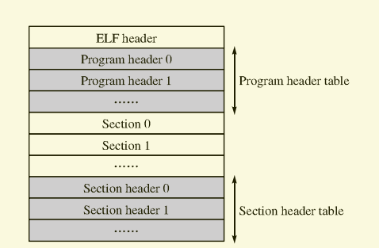

# ELF32(Executable and Linkable Format 32Bit)

​	我们现在就马上来编写我们可以使用gcc编译链接的内核，还记得吗？我们之前里面的内核都是一个假内核(loader.bin)。我们直接在Linux下编写一个C程序并编译成一个可执行文件是不行的，因为这样的话，gcc默认会将这个程序认为是一个Linux可执行程序，它会将程序按照Linux的规则来编译，还会将Linux所需要的库也一同链接，对于开发自己的操作系统来说，这是不必要的，而且我们也不需要main函数！我们演示一下直接编译的效果。

​	那我们怎么实现我们的内核编译呢？很简单，我们之前是直接 编译-链接一起做的，我们只要分开这两个步骤就可以了，先准备好我们需要编译的文件，将它们编译成中间文件，然后最后在一起链接在一起，就可以得到纯净的程序了，操作系统的开发不需要其它的杂七杂八的库，因为现在我们的系统现在什么都没有，导进来也没用。

​	我们需要创建一个nasm汇编文件kernel.asm，让其作为我们内核的入口，还需要汇编是因为最后链接需要指明程序入口_start符号，同时我们的内核开发依旧需要用汇编编写一些函数。然后再创建一个mian.c作为我们内核进入C语言的入口。在kernel.asm中调用main.c中的函数即可，然后将所有对象文件链接在一起就得到我们最简单的内核程序了，它通过elf32来实现，可以使用C语言，我们的目的就达成了！我们马上开始编写这个最简单的内核程序。

## ELF32详解

​	我们有了内核文件，我们马上来了解ELF32文件的结构，ELF32会告诉我们这个程序文件如何执行。

​	ELF文件结构：



我们可以看到，它由4部分组成：ELF头（ELF header）、程序头表（Program header table）、节/段（Sections）以节头表（Section header table）。一个ELF文件不一定会包含以上这些全部内容，位置也不一定像图中一样，但是，有一个东西是固定的：ELF header，其他的各部分信息，都由ELF header里的值来决定。

## ELF header

​	我们马上查看下ELF header的结构吧，它是我们运行内核文件的关键，我们直接查看开源库中的elf.h头文件，我们只关心ELF32，ELF64我们忽略。

ELF header以及里面各个成员的偏移如下：

```c
#define EI_NIDENT (16)

typedef struct
{
  /* 偏移：0 */
  unsigned char	e_ident[EI_NIDENT];	/* Magic number and other info */
  /* 偏移：16 */
  Elf32_Half	e_type;				/* Object file type */
  /* 偏移：18 */
  Elf32_Half	e_machine;			/* Architecture */
  /* 偏移：20 */
  Elf32_Word	e_version;			/* Object file version */
  /* 偏移：24 */
  Elf32_Addr	e_entry;			/* Entry point virtual address */
  /* 偏移：28 */
  Elf32_Off		e_phoff;			/* Program header table file offset */
  /* 偏移：32 */
  Elf32_Off		e_shoff;			/* Section header table file offset */
  /* 偏移：36 */
  Elf32_Word	e_flags;			/* Processor-specific flags */
  /* 偏移：40 */
  Elf32_Half	e_ehsize;			/* ELF header size in bytes */
  /* 偏移：42 */
  Elf32_Half	e_phentsize;		/* Program header table entry size */
  /* 偏移：44 */
  Elf32_Half	e_phnum;			/* Program header table entry count */
  /* 偏移：46 */
  Elf32_Half	e_shentsize;		/* Section header table entry size */
  /* 偏移：48 */
  Elf32_Half	e_shnum;			/* Section header table entry count */
  /* 偏移：50 */
  Elf32_Half	e_shstrndx;			/* Section header string table index */
} Elf32_Ehdr;	/* 大小：52字节 */
```

​	由于ELF32文件力求支持从8位～32位不同架构的处理器，所以定义了不同的数据类型，从而让文件格式与机器无关。

​	这些数据类型如下表所示：

| 名称          | 大小（字节） | 对齐（字节） | 用途                   |
| ------------- | ------------ | ------------ | ---------------------- |
| Elf32_Addr    | 4            | 4            | 无符号程序地址         |
| Elf32_Half    | 2            | 2            | 无符号中等大小整数     |
| ELF32_Off     | 4            | 4            | 无符号文件偏移         |
| ELF32_Sword   | 4            | 4            | 有符号大整数           |
| ELF32_Word    | 4            | 4            | 无符号大整数           |
| unsigned char | 1            | 1            | 字面意思，无符号小整数 |

​	以上的偏移和大小就是通过这些信息算出来的。

ELF32中各项的意义如下：

| 名称        | 意义                                                         |
| ----------- | ------------------------------------------------------------ |
| e_ident     | 包含魔数以及一些其他信息，我们只关心魔数，魔数正确则表示该文件是一个ELF文件。 |
| e_type      | 标识文件类型，可能的所有取值我们也暂时别关心，当为2时表示是一个可执行文件(Exectuable File)。 |
| e_machine   | 编译的机器平台，当为3时，表示80386。                         |
| e_version   | 当前文件的版本。                                             |
| e_entry     | 程序的入口地址。                                             |
| e_phoff     | Program header table在文件中的偏移量(字节)。                 |
| e_shoff     | Section header table在文件中的偏移量(字节)。                 |
| e_flags     | 处理器特殊标志，对于IA32，此项为0。                          |
| e_ehsize    | ELF header大小(字节)。                                       |
| e_phentsize | Program header table中一个条目(一个Program header)的大小。   |
| e_phnum     | Program header table中有多少个条目。                         |
| e_shentsize | Section header table中一个条目(一个Section header)的大小。   |
| e_shnum     | Section header table 中有多少个条目。                        |
| e_shstrndx  | 包含节(Section)名称的字符串表是第几个节(从0开始)。           |

​	接下来又有一个很重要的数据结构，它可以告诉我们程序的的所有段在哪里，我们知道这些信息就能将相应的代码段等段在哪里，应该跳转到哪里执行我们的程序了！这个结构就是Program header，它是Program header table 中的一个项。

Program header以及成员的各位偏移：

```c
typedef struct
{
  /* 偏移：0 */
  Elf32_Word	p_type;			/* Segment type */
  /* 偏移：4 */
  Elf32_Off		p_offset;		/* Segment file offset */
  /* 偏移：8 */
  Elf32_Addr	p_vaddr;		/* Segment virtual address */
  /* 偏移：12 */
  Elf32_Addr	p_paddr;		/* Segment physical address */
  /* 偏移：16 */
  Elf32_Word	p_filesz;		/* Segment size in file */
  /* 偏移：20 */
  Elf32_Word	p_memsz;		/* Segment size in memory */
  /* 偏移：24 */
  Elf32_Word	p_flags;		/* Segment flags */
  /* 偏移：28 */
  Elf32_Word	p_align;		/* Segment alignment */
} Elf32_Phdr;	/* 大小：32字节 */
```

它们各项的意义：

| 名称     | 意义                                           |
| -------- | ---------------------------------------------- |
| p_type   | 段类型                                         |
| p_offset | 段的第一个字节在文件中的偏移                   |
| p_vaddr  | 段的第一个字节在内存中的虚拟地址               |
| p_paddr  | 在物理地址定位相关的系统中，此项为物理地址保留 |
| p_filesz | 段在文件中的长度                               |
| p_memsz  | 段在内存中的长度                               |
| p_flags  | 与段相关的标志                                 |
| p_align  | 段在文件以及内存中如何对齐                     |

​	简单看上面各项的值，我们马上知道了，Program header描述的是一个段在文件中的位置、大小以及它被放进内存后所在的位置和大小。我们如果想把一个文件加载进内存的话，需要的正是这些信息。

## 如何加载一个ELF文件？

​	首先，我们先明确目的，我们需要加载可执行文件中的所有段到我们的内存中，然后就可以跳转执行了！根据这个目的，我们首先要通过ELF header知道Program header table，里面的Program header将会告诉我们程序的一个段，我们通过Program header中的信息将文件中的数据拷贝到内存中就可以啦！而至于ELF文件中的其它成员，我们就别管啦，以后用到再说啦～


​	

​	


