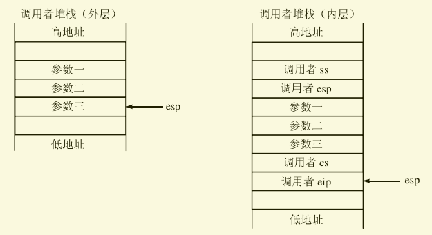

# IDT(Interrupt Descriptor Table)

​	IDT，又称中断描述符表，看名称就知道，它是一个描述符组成的表结构，本质上和GDT一样。区别在于GDT中的描述符是为了描述内存中的段的，它所使用的是段描述符，而IDT中的描述符是为了描述操作系统中的各种中断信息的，它就类似于在实模式下的中断向量表！IDT是保护模式下的产物。

​	我们上一期中，已经初始化了IDT指针指向了一个空的中断描述符表，但是，空的毕竟是空的，我们需要马上知道这个表需要什么？怎么填充并初始化它？只要里面的描述符被我们构建完整了，我们才能让计算机的中断机制再次启动起来。

# IDT中需要什么？

​	这是个好问题，我们现在马上来研究IDT中需要什么。

​	实际上，IDT中需要一个新的描述符结构，它被称之为“门描述符”，如同它的名字，这个描述符就像一扇门，我们可以打开它，看到内部的房间。门描述符主要定义了一段代码对应段的选择子、入口地址以及偏移和一些属性等，我们现在来看看它的结构。

.png)

​									*门描述符(Gate Descriptor)*

​	我们可以发现，它和段描述符(Segmemt Descriptor)有很多不同，但是它们的第4、和第5个字节都是一样的，用来表示属性。

​	直观来看，一个门描述了由一个选择子和一个偏移所指向的线性地址(没有开启分页则是物理地址)，这些信息保证了程序可以进行转移。同时，门描述符的结构分为以下四种类型：

- 调用门(Call gates)
- 中断门(Interrupt gates)
- 陷阱门(Trap gates)
- 任务门(Task gates)

		虽然有这么多类型，我们主要关心中断门，它是我们最后将要采用的门用于实现IDT。但是为了研究门的特性，我们可以从调用门开始了解。

一个调用门被call指令调用，然后跳转到相应的代码段并执行代码，其实一个"call 调用门"就”等同“于

```assembly
call 调用门中的选择子:调用门中的偏移 
```

​	但是如果它们完全一样，我们使用门的作用是什么呢？简单来说，通过调用门，可以实现从低特权级向高特权级的转移，无论目标代码段是一致还是非一致的。举个例子：有一个函数A，它在内核K中，而一个用户程序B想要调用函数A，如果直接通过call调用，那肯定会被禁止，因为用户特权级比较低，而内核处于最高特权级，这个时候我们只要提供一个调用门G，这个门指向函数A，并将其暴露给用户。那么，B就可以通过调用门G访问函数A了！这就是为什么我们在操作系统下编程，可以通过固定的系统调用来使用系统提供的功能了，这就是系统调用的秘密-门。

​	对于中断门，则跟调用门作用是一样的，只不过中断门不能通过call指令调用，而是int指令。所以我们来研究调用门，也就等于知道了中断门。

# 特权级转换的秘密

​	我们现在马上来揭开特权级转移的秘密。

## 短调用

​	我们先来看一个短调用(段内的call)，	它会引起的一个堆栈的变化，我们举个伪代码例子：

```assembly
调用者:
	push 参数1
    push 参数2
    push 参数3
    call 函数A
    nop
    ...
函数A:
	mov eax, [esp + 4]		; 拿到参数3
	mov ebx, [esp + 4 * 2]	; 拿到参数2
    mov ecx, [esp + 4 * 3]	; 拿到参数1
	...
	ret
```

​	这个时候，call之前和call之后的堆栈如图所示。


​	我们可以发现，我们要想拿到参数3(最后压栈最先得到)，我们以前的代码都必须要拿到esp指向的栈顶 + 4，那时候我们对这里并没有过多讲解，但从上面的图中我们就明白了，一图胜百句，call 指令执行后会自动的将调用者的eip压入栈中，所以我们这个 + 4，就是为了跳过eip参数，这个eip就对应于上面nop指令的地址，目的就是保存调用者的执行状态。

​	而ret指令将会自动进行短跳转short jmp到这个保存的eip中，然后将esp + 4，这样程序就可以继续往下执行了，同时堆栈也就恢复到了只有压入参数的状态，这个时候就需要我们调用者去add esp, 4 * 3去清理堆栈了。

## 长调用

​	长调用这才是我们的主题，因为使用一个门，如果发生了特权级的变化，那么肯定会发生段间的转移，因为一个段只能有一个特权级。

​	长调用的情况和短调用类似，容易联想到，短调用的ret是通过短跳转实现的，那么长调用自然就是通过长跳转far jmp实现咯。我们依旧使用上面的那段伪代码研究，但是现在我们假设函数A和调用者不在一个段中，所以会发生一个长调用。

​	一个长调用的ret需要一个长跳转实现，长跳转需要两个参数：far jmp cs:eip，所以返回的时候也需要调用者的cs，所以call指令执行的时候被压栈的就不仅有eip，还应该有cs，如下图所示。


​	好的，长调用我们也没什么特殊的，就是多压入了一个cs嘛。

## 堆栈的切换

​	你以为这样就结束了？并没有，长调用没有你想的那么简单，虽然堆栈的变化很直观，但是很不幸的是因为特权级发生了变化，那么堆栈也会发生切换（注意：不是变化，是切换！），假如说之前的堆栈特权级比较低，到了特权级级较高的代码中，我们自然就不能够使用原来的堆栈了，所以必须切换到特权级更高的新堆栈。什么意思呢？也就是说，call指令的前后的堆栈都不是同一个！那么奇怪的问题就出现了，我们在堆栈A中压入参数和call自动压入的cs:eip，等到需要使用它们的时候堆栈却已经是B了，是不是很奇怪？我们要怎么从B中拿到A中的值呢？

​	Intel已经帮我们搞定了，它提供了拷贝机制：将堆栈A的诸多内容拷贝到新堆栈B中，如下图所示。



​	在这里，我们涉及到两个堆栈，而事实上，由于每一个任务最多可能在4个特权级间跳转，所以每个任务都需要4个堆栈来支持。可是说这么多，我们就算有了这个多堆栈，可是我们却只有一个ss和一个esp寄存器啊！那么当发生堆栈切换，我们该从哪里获取其余堆栈的ss和esp呢？没关系，我们可以保存所有堆栈的ss和esp，这里就引入我们的主角：TSS(Task-State Segment)任务状态段，它是一个数据结构，里面包含多个字段，32位下的TSS如下图所示。

.png)

​	从图可知，TSS包含灰常多字段简直让人眼花缭乱，但我们来看重点：偏移4~27的3个ss:esp。当发生堆栈切换时，内层的ss和esp就从这里取得。ss0:esp0表示特权级0的堆栈，即内核堆栈，这就是为什么我们初始化tss的时候ss0被设置成了内核的数据段！同理ss1:esp1是特权级为1的堆栈，ss2:esp2是...，至于为什么没有ss3和esp3则是因为用户程序使用自己的堆栈，没必要提供！

​	举个栗子：我们当前所在特权级ring3，即用户特权级，当发生一次系统调用跳转到ring0的代码时，堆栈被自动的切换到ss0:esp0。

​	好了，多个堆栈切换的问题已经解决，我们看下整个跳转工作过程是怎么样的：

1. 根据目标代码段的DPL(描述符特权级)从TSS中选择应该切换到哪个ss和esp。

2.从TSS中读取新的ss:esp。如果这里发现ss/esp或者TSS的界限错误都会产生一个无效TSS异常(#TS)。

3.对ss描述符进行校验，如果发生错误，同样产生#TS异常。

4.暂时保存当前ss:esp的值，即调用者的ss:esp。

5.加载新的ss:esp。

6.将刚才保存的ss:esp压入新栈。

7.从调用者堆栈中将参数拷贝到新堆栈中，复制参数的数量由门中的Param Count值决定。如果Param Count为0则不会拷贝任何参数。

8.将当前调用者的cs:eip压栈。
9.加载门中指定的新的cs:eip，开始执行新的代码。	


​	在第7步中，我们就明白门中的Param Count的作用，至此，门中各个部分的作用都没有疑问了。这里值得注意的一点是，Param Count只有5位，也就是说一个门指向的例程最多只能有31个参数，只能拷贝31个参数，如果参数多于31个，需要使用指针传递数据结构来达到传递更多参数的作用，又或者直接通过保存在新堆栈中的ss:esp来访问旧堆栈。

​	上面就是长call的全过程，而长ret就是上面的反过程，我们就暂不多提了。

# Flyanx的IDT

​	通过上面的理论，我们马上为我们的系统考虑IDT的初始化吧！很明显调用门是可以用在IDT中的，但是我拒绝！因为Minix和Linux都是使用的中断门来实现中断和异常机制以及系统调用的，为了少走弯路，Flyanx我也决定采用全部中断门的IDT来实现，好多好说还有前辈的代码作为参考呢～


