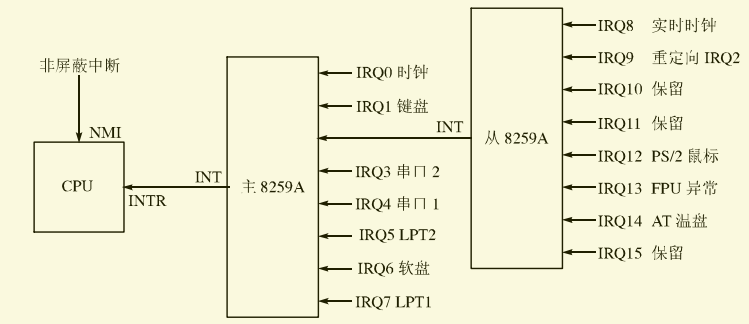
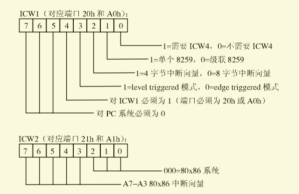
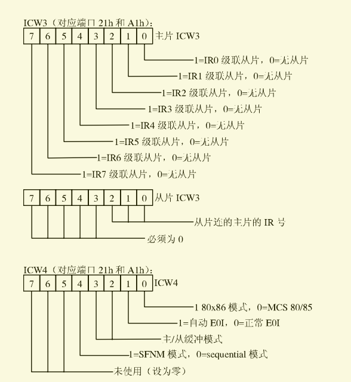
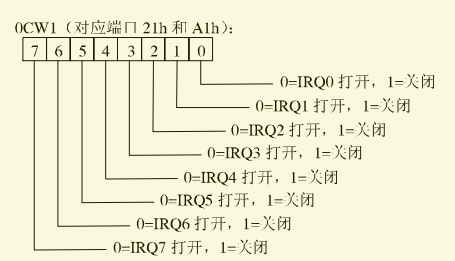
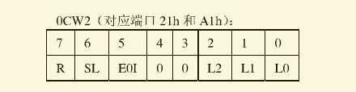

# Flyanx的中断和异常机制

​	现在我们马上了解一些已经学过的操作系统理论-中断，它们是一个操作系统的基础，举个例子，一个人在祖安和大家友好的交流，他这时候就会以极快的速度敲击键盘进行输入，操作系统要怎么知道他敲击了什么按键？然后怎么处理这个动作？

​	这是由中断去完成的，当敲击键盘时，硬件会产生一个中断，然后操作系统能及时的被唤醒去执行应付这个中断的代码，这就是中断的意义所在。

​	中断又分为硬件中断和软件中断，硬件中断由硬件产生，例如键盘、时钟、磁盘驱动器、打印机等等，这些硬件会在特定的情况下产生中断，而操作系统则完成对这些中断的处理，但它不是非必须的，有些硬件中断由个人意愿想忽略也是一点问题都没有的；软件中断则由程序通过代码产生，触发源不一样，例如程序员可以主动触发一些中断，它们一般是操作系统提供的。但它们都有一个共同点，操作系统一旦运行起来，则会根据操作系统提前编写的规则进行监听，当它们发生后系统立刻暂停并保存当前的工作并执行相应的代码进行处理，处理完毕再恢复操作系统之前的工作。

​	为什么我们先讲中断，因为异常和中断作用机理都相似，它们都是程序执行中出现一些特殊情况然后进行的强制性转移，转到相应的处理程序。只不过中断通常在程序执行时因为硬件而随机发生，它们通常用来处理CPU外部事件，比如外围设备（例如键盘）的请求，软件可以通过int n的形式产生中断。异常则通常在CPU执行指令过程中检测到错误时发生，比如零除错误，CPU检测的错误条件很多，现在我们来看看保护模式下已经使用的中断/异常和向量号之间的对应关系吧。	

| 向量号 | 助记符 | 描述                       | 类型       | 是否有出错码 | 发生的源                                              |
| ------ | ------ | -------------------------- | ---------- | ------------ | ----------------------------------------------------- |
| 0      | #DE    | 除法错误                   | Fault      | 无           | DIV和IDIV指令                                         |
| 1      | #DB    | 调试异常                   | Fault/Trap | 无           | 任何代码和数据的访问                                  |
| 2      | —      | 非屏蔽中断                 | Interrupt  | 无           | 非屏蔽外部中断                                        |
| 3      | #BP    | 调试断点                   | Trap       | 无           | 指令int 3                                             |
| 4      | #OF    | 溢出                       | Trap       | 无           | 指令into                                              |
| 5      | #BR    | 越界                       | Fault      | 无           | 指令bound                                             |
| 6      | #UD    | 无效(未定义的)操作码       | Fault      | 无           | 指令ud2或无效指令                                     |
| 7      | #NM    | 设备不可用(无数学协处理器) | Fault      | 无           | 浮点指令或wait/fwait指令                              |
| 8      | #DF    | 双重错误                   | Abort      | 有(零)       | 所有能产生的异常或nmi或intr的指令                     |
| 9      |        | 协处理器段越界(保留)       | Fault      | 无           | 浮点指令(386之后的IA32处理器不再有这种异常)           |
| 10     | #TS    | 无效TSS                    | Fault      | 有           | 任务切换或访问TSS时                                   |
| 11     | #NP    | 段不存在                   | Fault      | 有           | 加载段寄存器或访问系统段时                            |
| 12     | #SS    | 堆栈段错误                 | Fault      | 有           | 堆栈操作或加载SS时                                    |
| 13     | #GP    | 常规保护错误               | Fault      | 有           | 内存或其他保护校验                                    |
| 14     | #PF    | 页错误                     | Fault      | 有           | 内存访问                                              |
| 15     | —      | Intel保留，不使用          |            |              |                                                       |
| 16     | #MF    | x87FPU浮点数(数学错误)     | Fault      | 无           | x87FPU浮点指令或wait/fwait指令                        |
| 17     | #AC    | 对齐校验                   | Fault      | 有(零)       | 内存中的数据访问(486开始支持)                         |
| 18     | #MC    | 机器检查                   | Abort      | 无           | 错误码(如果有的话)和源依赖于具体模式(奔腾CPU开始支持) |
| 19     | #XF    | SIMD浮点异常               | Fault      | 无           | SSE和SSE2浮点指令(奔腾lll开始支持)                    |
| 20-31  | —      | Intel保留，不使用          |            |              |                                                       |
| 32-255 | —      | 用户可自定义的中断         | Interrupt  |              | 外部中断或int n指令                                   |

## 异常处理

​	异常产生的中断向量号是固定的，我们自然不能够自定义，这样我们编写异常处理就比较简单了，编写不同的函数去初始化不同的异常中断门就可以了并放入到IDT中就没问题了，我们马上编写异常处理。

​	为了方便，我们将所有异常按照向量号顺序制作一张异常提示表，然后编写一个处理程序去处理它们，这张表我将其贴在下面。

```c
/* 异常信息表 */
char* exception_table[] = {
        "#DE Divide Error",                                 /* 除法错误 */
        "#DB RESERVED",                                     /* 调试异常 */
        "—   NMI Interrupt",                                /* 非屏蔽中断 */
        "#BP Breakpoint",                                   /* 调试断点 */
        "#OF Overflow",                                     /* 溢出 */
        "#BR BOUND Range Exceeded",                         /* 越界 */
        "#UD Invalid Opcode (Undefined Opcode)",            /* 无效(未定义的)操作码 */
        "#NM Device Not Available (No Math Coprocessor)",   /* 设备不可用(无数学协处理器) */
        "#DF Double Fault",                                 /* 双重错误 */
        "    Coprocessor Segment Overrun (reserved)",       /* 协处理器段越界(保留) */
        "#TS Invalid TSS",                                  /* 无效TSS */
        "#NP Segment Not Present",                          /* 段不存在 */
        "#SS Stack-Segment Fault",                          /* 堆栈段错误 */
        "#GP General Protection",                           /* 常规保护错误 */
        "#PF Page Fault",                                   /* 页错误 */
        "—   (Intel reserved. Do not use.)",                /* Intel保留，不使用 */
        "#MF x87 FPU Floating-Point Error (Math Fault)",    /* x87FPU浮点数(数学错误) */
        "#AC Alignment Check",                              /* 对齐校验 */
        "#MC Machine Check",                                /* 机器检查 */
        "#XF SIMD Floating-Point Exception",                /* SIMD浮点异常 */
};
```

​	之后我们用汇编编写每个异常的处理函数，它们将中断号和错误代码压入，最后统一调用一个处理函数，由于异常数量太多，我们直接贴出实现，它们十分简单，我们不会浪费太多时间。

```assembly
; 所有的异常处理入口
global divide_error
global single_step_exception
global nmi
global breakpoint_exception
global overflow
global bounds_check
global inval_opcode
global copr_not_available
global double_fault
global copr_seg_overrun
global inval_tss
global segment_not_present
global stack_exception
global general_protection
global page_fault
global copr_error

divide_error:
	push	0xffffffff	; 没有错误代码，用0xffffffff表示
	push	0		    ; 中断向量号	= 0
	jmp	exception
single_step_exception:
	push	0xffffffff	; 没有错误代码，用0xffffffff表示
	push	1		    ; 中断向量号	= 1
	jmp	exception
nmi:
	push	0xffffffff	; 没有错误代码，用0xffffffff表示
	push	2		    ; 中断向量号	= 2
	jmp	exception
breakpoint_exception:
	push	0xffffffff	; 没有错误代码，用0xffffffff表示
	push	3		    ; 中断向量号	= 3
	jmp	exception
overflow:
	push	0xffffffff	; 没有错误代码，用0xffffffff表示
	push	4		    ; 中断向量号	= 4
	jmp	exception
bounds_check:
	push	0xffffffff	; 没有错误代码，用0xffffffff表示
	push	5		    ; 中断向量号	= 5
	jmp	exception
inval_opcode:
	push	0xffffffff	; 没有错误代码，用0xffffffff表示
	push	6		    ; 中断向量号	= 6
	jmp	exception
copr_not_available:
	push	0xffffffff	; 没有错误代码，用0xffffffff表示
	push	7		    ; 中断向量号	= 7
	jmp	exception
double_fault:
	push	8		    ; 中断向量号	= 8
	jmp	exception
copr_seg_overrun:
	push	0xffffffff	; 没有错误代码，用0xffffffff表示
	push	9		    ; 中断向量号	= 9
	jmp	exception
inval_tss:
	push	10		    ; 中断向量号	= 10
	jmp	exception
segment_not_present:
	push	11		    ; 中断向量号	= 11
	jmp	exception
stack_exception:
	push	12		    ; 中断向量号	= 12
	jmp	exception
general_protection:
	push	13		    ; 中断向量号	= 13
	jmp	exception
page_fault:
	push	14		    ; 中断向量号	= 14
	jmp	exception
copr_error:
	push	0xffffffff	; 没有错误代码，用0xffffffff表示
	push	16		    ; 中断向量号	= 16
	jmp	exception

exception:
	call	exception_handler
	add	esp, 4 * 2	    ; 让栈顶指向 EIP，堆栈中从顶向下依次是：EIP、CS、EFLAGS
.down:
	hlt                 ; CPU停止运转，宕机
    jmp .down           ; 
```

​	对于如果没有错误码的异常，我们手动设置错误码参数为0xffffffff来表示没有错误码，如果有错误码，CPU会自动将其压入栈中，所以我们就不需要压入了。这些异常处理函数最终都会调用一个统一的处理函数exception_handler，我们现在马上编写它。最后至于为什么要用汇编来编写这些异常入口函数，则是因为用C语言来编写这些函数的话，不给满两个参数连编译都过不去，而异常则是由系统给定参数我们不能写死手动给，所以这里我们只能用汇编编写。拷贝进去后别忘了将它们都声明出来，C语言才能识别得到。

```c
/*================================================================================================*/
/* 异常处理入口例程 */
/*================================================================================================*/
_PROTOTYPE( void divide_error, (void) );
_PROTOTYPE( void single_step_exception, (void) );
_PROTOTYPE( void nmi, (void) );
_PROTOTYPE( void breakpoint_exception, (void) );
_PROTOTYPE( void overflow, (void) );
_PROTOTYPE( void bounds_check, (void) );
_PROTOTYPE( void inval_opcode, (void) );
_PROTOTYPE( void copr_not_available, (void) );
_PROTOTYPE( void double_fault, (void) );
_PROTOTYPE( void inval_tss, (void) );
_PROTOTYPE( void copr_not_available, (void) );
_PROTOTYPE( void segment_not_present, (void) );
_PROTOTYPE( void stack_exception, (void) );
_PROTOTYPE( void general_protection, (void) );
_PROTOTYPE( void page_fault, (void) );
_PROTOTYPE( void copr_seg_overrun, (void) );
_PROTOTYPE( void copr_error, (void) );
_PROTOTYPE( void divide_error, (void) );
```

​	万事具备，我们马上把这些编写完成的异常处理例程初始化到我们的中断表IDT中，这样计算机发生异常就会自动的去IDT下找对应的中断号的门来处理了。我们依旧是为了初始化方便，创建一个张表专门存放所有中断门信息的表，存放我们所有的异常门信息。这些工作都是重复的，我也提前将这个表贴出来。

```c
/* 中断门信息 */
struct gate_desc_s {
    u8_t vector;            /* 调用向量号 */
    int_handler_t handler;  /* 处理例程 */
    u8_t privilege;         /* 门权限 */
};

/* 中断门信息表 */
struct gate_desc_s int_gate_table[] = {
        /* ************* 异常 *************** */
        { INT_VECTOR_DIVIDE, divide_error, KERNEL_PRIVILEGE },
        { INT_VECTOR_DEBUG, single_step_exception, KERNEL_PRIVILEGE },
        { INT_VECTOR_NMI, nmi, KERNEL_PRIVILEGE },
        { INT_VECTOR_BREAKPOINT, breakpoint_exception, KERNEL_PRIVILEGE },
        { INT_VECTOR_OVERFLOW, overflow, KERNEL_PRIVILEGE },
        { INT_VECTOR_BOUNDS, bounds_check, KERNEL_PRIVILEGE },
        { INT_VECTOR_INVAL_OP, inval_opcode, KERNEL_PRIVILEGE },
        { INT_VECTOR_COPROC_NOT, copr_not_available, KERNEL_PRIVILEGE },
        { INT_VECTOR_DOUBLE_FAULT, double_fault, KERNEL_PRIVILEGE },
        { INT_VECTOR_COPROC_SEG, copr_seg_overrun, KERNEL_PRIVILEGE },
        { INT_VECTOR_INVAL_TSS, inval_tss, KERNEL_PRIVILEGE },
        { INT_VECTOR_SEG_NOT, segment_not_present, KERNEL_PRIVILEGE },
        { INT_VECTOR_STACK_FAULT, stack_exception, KERNEL_PRIVILEGE },
        { INT_VECTOR_PROTECTION, general_protection, KERNEL_PRIVILEGE },
        { INT_VECTOR_PAGE_FAULT, page_fault, KERNEL_PRIVILEGE },
        { INT_VECTOR_COPROC_ERR, copr_error, KERNEL_PRIVILEGE },
};
```

## 硬件中断

​	硬件中断也称为外部中断，它们由硬件产生，但它们也可以由int n主动产生一个硬件中断，只要配置完成就可以。其又分为不可屏蔽中断（NMI）和可屏蔽中断两种，它们分别由CPU的两根引脚NMI和INTR来接收，如图所示。



​	NMI是不可屏蔽，即使IF标志位设置为屏蔽值也照常产生，它对应的中断向量号为2。而我们从图中可以看出，可屏蔽中断是由外部一个硬件的支持-可编程中断控制芯片8259A。可屏蔽中断与CPU之间的关系就是通过8259A建立关联的，8259A的每个接口都会连接一个设备，当对应设备发生中断时，8259A就会进行响应，但是如果IF标志已经将其设置为屏蔽中断，那么它也就不会响应了。同时我们发现，与CPU相连的不是一片，而是两片级联的8259A，每个8259A有8根中断信号线，于是总共可以连接15个不同的外部设备。

​	现在问题出现了，连接的设备发出中断请求时如何与中断向量对应呢？这时候需要程序员自己完成一些操作了，因为8259A是可编程的，在BIOS初始化它的时候，IRQ0~IRQ7被设置为向量号08H~0fH，而不巧的是我们通过上图可知，计算机进入保护模式的时候它们已经被占用了，所以我们在内核启动时不得不重新设置一下主从两个8259A可编程中断控制芯片。

## 8259A的初始化

​	在那之前，我们还需要两个汇编编写的函数in_byte和out_byte，对设备端口的读写需要汇编的两条特殊指令out、in。

```assembly
global in_byte                  ; 从一个端口读取一字节数据
global out_byte                 ; 向一个端口输出一字节数据

;============================================================================
;   从一个端口读取一字节数据
; 函数原型： u8_t in_byte(port_t port)
;----------------------------------------------------------------------------
align 16
in_byte:
    push edx
        mov edx, [esp + 4 * 2]      ; 得到端口号
        xor eax, eax
        in al, dx              ; port -> al
        nop                         ; 一点延迟
    pop edx
    nop
    ret
;============================================================================
;   向一个端口输出一字节数据
; 函数原型： void out_byte(port_t port, U8_t value)
;----------------------------------------------------------------------------
align 16
out_byte:
    push edx
        mov edx, [esp + 4 * 2]      ; 得到端口号
        mov al, [esp + 4 * 3]   ; 要输出的字节
        out dx, al              ; al -> port
        nop                         ; 一点延迟
    pop edx
    nop
    ret
    
// C语言中的声明
_PROTOTYPE( u8_t in_byte, (port_t port) );
_PROTOTYPE( void out_byte, (port_t port, U8_t value) );
```

​	但是请注意，这两个函数一次执行读写一个字节的数据，分别是out_byte和in_byte，如果以后需要对一个端口读写多个字节，则需要多次调用来完成功能。或者调用可以读写端口一个字的out_word和in_word，但这两个函数我并不是很爱用，我会选择调用多次in_byte、out_byte来完成。提供它们是为了大家使用，毕竟有的人喜欢一下子输出更多的数据，也有人像我一样喜欢大事化小，分成更细的步骤来做。

​	在这，也将out_word和in_word的实现贴出来：

```assembly
global in_word                  ; 从一个端口读取一字数据
global out_word                 ; 向一个端口输出一字数据

;============================================================================
;   从一个端口读取一字数据
; 函数原型： u16_t in_word(port_t port)
;----------------------------------------------------------------------------
align 16
in_word:
    push edx
        mov edx, [esp + 4 * 2]      ; 得到端口号
        xor eax, eax
        in ax, dx              ; port -> ax
    pop edx
    nop                         ; 一点延迟
    ret
;============================================================================
;   向一个端口输出一字数据
; 函数原型： void out_word(port_t port, U16_t value)
;----------------------------------------------------------------------------
align 16
out_word:
    push edx
        mov edx, [esp + 4 * 2]      ; 得到端口号
        mov ax, [esp + 4 * 3]   ; 得到要输出的变量
        out dx, ax              ; ax -> port
    pop edx
    nop                         ; 一点延迟
    ret
 
// C语言中的声明
_PROTOTYPE( u16_t in_word, (port_t port) );
_PROTOTYPE( void out_word, (port_t port, U16_t value) );
```

​	那么这个8259A怎么初始化呢？先看下它的端口操作。对它的设置并不复杂，我们只需要对对应的端口写入特定的ICW(Initialization Command Word)即可。主8259A的端口地址是20H和21H，从8259A的端口地址为a0H和a1H。ICW则共有4个，每一个都是固定格式的字节，格式如下面的两张图所示。



 

​	接下来我们看一下文档给出的初始化过程：

（1） 向端口0x20(主片)或0xa0(从片)写入ICW1。

（2） 向端口0x21(主片)或0xa1(从片)写入ICW2。

（3） 向端口0x21(主片)或0xa1(从片)写入ICW3。

（4） 向端口0x21(主片)或0xa1(从片)写入ICW4。

请注意：这四步顺序不能颠倒，必须严格按顺序进行！

​	好的，知道了具体步骤，我们还等个屁，马上开始编写8259A的初始化代码。

​	初始化完毕后，我们再看看以后如何控制8259A开关某个中断吧，8259A还提供了OCW(Operation Control Word)，它可以对8259A进行操作，OCW也有3个，但是由于Flyanx只在两种情况下使用到它，因此我们只需要了解以下两种情况即可。

​	1 屏蔽或打开硬件（外部）中断。

​	2 发送EOI给8259A以通知它中断处理结束。

若想屏蔽或打开硬件中断，只需往8259A的操作端口0x21/0xa1写入OCW1就可以了，OCW1的格式如下图所示。



​	从图中很容易看出，一个字节的OCW某位如果设为1则表示关闭8259A上索引0~7中的对应中断，不管是主片从片，它们都是一样使用的。虽然我们上面初始化了8259A，但是依旧没有给每个中断合适的处理例程，所以我们现在利用OCW1先将我们的所有中断屏蔽。

​	而第二种情况则是因为当一次中断发生时，CPU会默认关闭中断，并且8259A也会自动设置为不再继续响应，如果需要继续响应中断，需要重新发送一个 EOI 给8259A重新开启，然后再手动开启中断。而发送 EOI 是通过向端口0x20或0xa0写OCW2来实现的，OCW2的格式如下图所示。



​	一个EOI即是一个字节0010000B(0x20)，则发送代码可以由以下代码实现，达到重新启用中断的作用

```assembly
mov al, 0x20
out 0x20/0xa0, al
```

​	而OCW2其他各位的作用，我们现在暂时不必理会，以后我们大概也接触不到。

​	以上就是我们需要实现中断机制现在所需要的所有硬件知识，我们马上开始编写Flyanx的中断处理吧。现在我们还没有对其中的设备进行驱动编写，所以我们将它们初始化指向一个临时的例程保证中断机制的正常运行就可以了。

## 硬件中断处理的编写

​	首先，因为中断请求(IRQ)之间是连续的(0~15)，为了方便，我们可以编写一个中断处理例程表来存放所有中断的处理例程，调用的时候只需要通过向中断请求号作为索引从表中获取对应例程就可以了，这是我们的第一步。

​	接下来我们就要像异常一样，为每个硬件中断向量提供一个单独的处理入口，这样才能分别初始化它们的中断门描述符，由于它们的处理都有一致性，我们可以编写一个公共的处理函数像异常一样，然后通过传不同的中断请求号来对每个中断进行不同的处理。但是在这里，我决定和MINIX一样，不编写函数来处理中断，而是编写一个宏来处理，原因是调用函数需要较高的系统资源消耗(调用函数会被gcc编译器编译成自动保存所有可能的寄存器)，使用宏来进行展开，可以提高中断处理的性能，因为中断是无时不刻在发生的，例如键盘中断，还有时钟中断（触发频率为：毫秒级别），为了系统以后的整体性能，我们可以牺牲一点宏展开的代码重复占用空间，也就是说：我们牺牲了一些存储空间来获取更好的运行效率。

​	这又是一项重复的工作，而且对他们函数的声明也很无脑，没必要为此浪费大家宝贵的时间，我们直接在这里贴出。

```assembly
; 所有中断处理入口，一共16个(两个8259A)
global	hwint00
global	hwint01
global	hwint02
global	hwint03
global	hwint04
global	hwint05
global	hwint06
global	hwint07
global	hwint08
global	hwint09
global	hwint10
global	hwint11
global	hwint12
global	hwint13
global	hwint14
global	hwint15


;----------------------------------------------------------------------------
align	16
hwint00:		; Interrupt routine for irq 0 (the clock)，时钟中断
	hwint_master	0

align	16
hwint01:		; Interrupt routine for irq 1 (keyboard)，键盘中断
	hwint_master	1

align	16
hwint02:		; Interrupt routine for irq 2 (cascade!)
	hwint_master	2

align	16
hwint03:		; Interrupt routine for irq 3 (second serial)
	hwint_master	3

align	16
hwint04:		; Interrupt routine for irq 4 (first serial)
	hwint_master	4

align	16
hwint05:		; Interrupt routine for irq 5 (XT winchester)
	hwint_master	5

align	16
hwint06:		; Interrupt routine for irq 6 (floppy)，软盘中断
	hwint_master	6

align	16
hwint07:		; Interrupt routine for irq 7 (printer)，打印机中断
	hwint_master	7
;----------------------------------------------------------------------------
align	16
hwint08:		; Interrupt routine for irq 8 (realtime clock).
	hwint_slave	8

align	16
hwint09:		; Interrupt routine for irq 9 (irq 2 redirected)
	hwint_slave	9

align	16
hwint10:		; Interrupt routine for irq 10
	hwint_slave	10

align	16
hwint11:		; Interrupt routine for irq 11
	hwint_slave	11

align	16
hwint12:		; Interrupt routine for irq 12
	hwint_slave	12

align	16
hwint13:		; Interrupt routine for irq 13 (FPU exception)
	hwint_slave	13

align	16
hwint14:		; Interrupt routine for irq 14 (AT winchester)
	hwint_slave	14

align	16
hwint15:		; Interrupt routine for irq 15
	hwint_slave	15
	
	
// C语言中的声明	
/*================================================================================================*/
/*  硬件中断处理程序。 */
/*================================================================================================*/
_PROTOTYPE( void	hwint00, (void) );
_PROTOTYPE( void	hwint01, (void) );
_PROTOTYPE( void	hwint02, (void) );
_PROTOTYPE( void	hwint03, (void) );
_PROTOTYPE( void	hwint04, (void) );
_PROTOTYPE( void	hwint05, (void) );
_PROTOTYPE( void	hwint06, (void) );
_PROTOTYPE( void	hwint07, (void) );
_PROTOTYPE( void	hwint08, (void) );
_PROTOTYPE( void	hwint09, (void) );
_PROTOTYPE( void	hwint10, (void) );
_PROTOTYPE( void	hwint11, (void) );
_PROTOTYPE( void	hwint12, (void) );
_PROTOTYPE( void	hwint13, (void) );
_PROTOTYPE( void	hwint14, (void) );
_PROTOTYPE( void	hwint15, (void) );
```

​	这些入口我们有了，但是其中的hwint_master和hwint_slave这个两个宏展开我们还没有，现在我们将这两个宏编写出来，一个处理主8259A的所有中断，一个处理从8259A的中断，至于为什么要分开则是因为它们两个的处理情况有一点点不同，分开会比较好，如果是主8259A的中断处理，我们应该完成以下的处理。

​	1	屏蔽当前中断，防止短时间内连续发生好几次同样的中断

​	2 	重新启用 主8259A 和中断响应；CPU 响应一个中断后会自动关闭中断，同时 8259A 也会自动关闭自己;CPU 响应一个中断后会自动关闭中断，同时 8259A 也会自动关闭自己，重新启用中断响应是为了及时的响应其他中断，很简单的道理：你在敲键盘的时候？就不允许磁盘中断响应操作磁盘了么？

​	3 	调用中断处理例程表中对应的例程

​	4	最后，判断中断处理例程的返回值，如果是DISABLE(0)，我们就直接结束；如果不为0，那么我们就重新启用当前中断

​	而如果是从8259A，第2步则有稍许不同，我们需要重新启用 主从两个8259A 和中断响应，因为从8259A是级联在主8259A上的，所以从8259A关闭自己时直接将主8259A也一起关闭了！

​	好的，我们做完这些工作以后，还差最后一步，我们在中断门描述符信息表中加入对于硬件中断的处理。

```c
/* ************* 硬件中断 *************** */
        { INT_VECTOR_IRQ0 + 0, hwint00, KERNEL_PRIVILEGE },
        { INT_VECTOR_IRQ0 + 1, hwint01, KERNEL_PRIVILEGE },
        { INT_VECTOR_IRQ0 + 2, hwint02, KERNEL_PRIVILEGE },
        { INT_VECTOR_IRQ0 + 3, hwint03, KERNEL_PRIVILEGE },
        { INT_VECTOR_IRQ0 + 4, hwint04, KERNEL_PRIVILEGE },
        { INT_VECTOR_IRQ0 + 5, hwint05, KERNEL_PRIVILEGE },
        { INT_VECTOR_IRQ0 + 6, hwint06, KERNEL_PRIVILEGE },
        { INT_VECTOR_IRQ0 + 7, hwint07, KERNEL_PRIVILEGE },
        { INT_VECTOR_IRQ8 + 0, hwint08, KERNEL_PRIVILEGE },
        { INT_VECTOR_IRQ8 + 1, hwint09, KERNEL_PRIVILEGE },
        { INT_VECTOR_IRQ8 + 2, hwint10, KERNEL_PRIVILEGE },
        { INT_VECTOR_IRQ8 + 3, hwint11, KERNEL_PRIVILEGE },
        { INT_VECTOR_IRQ8 + 4, hwint12, KERNEL_PRIVILEGE },
        { INT_VECTOR_IRQ8 + 5, hwint13, KERNEL_PRIVILEGE },
        { INT_VECTOR_IRQ8 + 6, hwint14, KERNEL_PRIVILEGE },
        { INT_VECTOR_IRQ8 + 7, hwint15, KERNEL_PRIVILEGE },
```

​	至此，我们的中断机制也已经初始化完毕，但是我们不要忘了，我们依旧处于关闭中断的状态下，而且其中的例程是写死的，为了以后便于管理，我们马上编写两个汇编语言的库例程，来专门开启中断和关闭中断。

```assembly
global interrupt_lock           ; 关闭中断响应，即锁中断
global interrupt_unlock         ; 打开中断响应，即解锁中断

;============================================================================
;   关闭中断响应，也称为锁中断
; 函数原型： void interrupt_lock(void)
;----------------------------------------------------------------------------
align 16
interrupt_lock:
        cli
    ret
;============================================================================
;   打开中断响应，也称为解锁中断
; 函数原型： void interrupt_unlock(void)
;----------------------------------------------------------------------------
align 16
interrupt_unlock:
        sti
    ret
    
// C语言中的声明	
_PROTOTYPE(  void interrupt_lock, (void) );
_PROTOTYPE(  void interrupt_unlock, (void) );
```

​	可以看出，这两个例程只有一条指令，其实我们可以使用C语言嵌套内联汇编来完成，这样做还能节省调用函数的系统开销，但是我对于这项行为绝对拒绝！因为内嵌汇编将会使我们的系统可读性变差(Linux很喜欢内嵌汇编，说实话，读起来很难受)，所以我的系统要像前/后端分离一样，汇编和C语言要完全分开。

​	最后，我们再编写两个函数，用它门操作8259A来精准的操作单个中断的关闭和打开，我们在前面已经编写过	中断处理模板了，也知道如何专门打开或关闭某个中断了，所以我们不做重复的工作，我在这直接贴出。

```assembly
global disable_irq              ; 屏蔽一个特定的中断
global enable_irq               ; 启用一个特定的中断

;============================================================================
;   屏蔽一个特定的中断
; 函数原型： int disable_irq(int int_request);
;----------------------------------------------------------------------------
align 16
disable_irq:
    pushf                   ; 将标志寄存器 EFLAGS 压入堆栈，需要用到test指令，会改变 EFLAGS
    push ecx

        cli                     ; 先屏蔽所有中断
        mov ecx, [esp + 4 * 3]  ; ecx = int_request(中断向量)
        ; 判断要关闭的中断来自于哪个 8259A
        mov ah, 1               ; ah = 00000001b
        rol ah, cl              ; ah = (1 << (int_request % 8))，算出在int_request位的置位位图，例如2的置位位图是00000100b
        cmp cl, 7
        ja disable_slave        ; 0~7主，8~15从；> 7是从，跳转到 disable_slave 处理 从8259A 的中断关闭
disable_master:                 ; <= 7是主
        in al, INT_M_CTLMASK    ; 取出 主8259A 当前的屏蔽位图
        test al, ah
        jnz disable_already     ; 该int_request的屏蔽位图不为0，说明已经被屏蔽了，没必要继续了
        ; 该int_request的屏蔽位图为0，还未被屏蔽
        or al, ah               ; 将该中断的屏蔽位置位，表示屏蔽它
        out INT_M_CTLMASK, al   ; 输出新的屏蔽位图，屏蔽该中断
        jmp disable_ok          ; 屏蔽完成
disable_slave:
        in al, INT_S_CTLMASK    ; 取出 从8259A 当前的屏蔽位图
        test al, ah
        jnz disable_already     ; 该int_request的屏蔽位图不为0，说明已经被屏蔽了，没必要继续了
        ; 该int_request的屏蔽位图为0，还未被屏蔽
        or al, ah               ; 将该中断的屏蔽位置位，表示屏蔽它
        out INT_S_CTLMASK, al   ; 输出新的屏蔽位图，屏蔽该中断
disable_ok:
    pop ecx
    popf
    and eax, 1              ; 等同于 mov eax, 1，即return 1；我只是想耍个帅！
    ret
disable_already:
    pop ecx
    popf                    ; 恢复标志寄存器
    xor eax, eax            ; return 0，表示屏蔽失败，因为该中断已经处于屏蔽状态
    ret
;============================================================================
;   启用一个特定的中断
; 函数原型： void enable_irq(int int_request);
;----------------------------------------------------------------------------
align 16
enable_irq:
    pushf                   ; 将标志寄存器 EFLAGS 压入堆栈，需要用到test指令，会改变 EFLAGS
    push ecx

        cli                     ; 先屏蔽所有中断
        mov ecx, [esp + 4 * 3]  ; ecx = int_request(中断向量)
        mov ah, ~1              ; ah = 11111110b
        rol ah, cl              ; ah = ~(1 << (int_request % 8))，算出在int_request位的复位位位图，例如2的置位位图是11111011b
        cmp cl, 7
        ja enable_slave         ; 0~7主，8~15从；> 7是从，跳转到 disable_slave 处理 从8259A 的中断关闭
enable_master:                  ; <= 7是主
        in al, INT_M_CTLMASK    ; 取出 主8259A 当前的屏蔽位图
        and al, ah              ; 将该中断的屏蔽位复位，表示启用它
        out INT_M_CTLMASK, al   ; 输出新的屏蔽位图，启用该中断
        jmp enable_ok
enable_slave:
        in al, INT_S_CTLMASK    ; 取出 从8259A 当前的屏蔽位图
        and al, ah              ; 将该中断的屏蔽位复位，表示启用它
        out INT_S_CTLMASK, al   ; 输出新的屏蔽位图，启用该中断
enable_ok:
      pop ecx
      popf
      ret
      
// C语言中的声明
_PROTOTYPE( int disable_irq, (int int_request) );
_PROTOTYPE( void enable_irq, (int int_request) );
```

​	有些这两个例程，我们马上为我们的中断功能添加一个新功能：设置并注册中断处理例程。我们的硬件中断表中，现在存放的都是一个没啥用的例程default_int_hanler，它只是权宜之计，之后我们一旦将一个硬件的驱动编写完成，那么就可以调用本例程来为其设置真正的中断处理例程了，它将会替换掉初始化时默认的default_int_hanler例程。

## 软件中断

​	软件中断没啥好提的，我们只要提供的在32-255这个范围内定义自己的中断就可以了，同时硬件中断用掉了32~47，分配给硬件的中断号，就不能再用了。例如我们给57初始化了一个中断门，指向一个函数A，那么以后我们在汇编中，只需要通过int 57指令就可以访问函数A了。

​	但是现在我们还没必要使用软件中断，我们还没有任何功能可以提供作为系统调用，但我们可以编写一个简单的作为测试的软件中断看看效果！

​	我们马上开始演示如何为操作系统添加一个自定义的软件中断～


