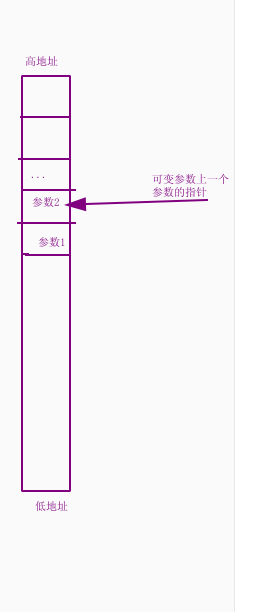

# C语言的可变参数(...)

```c
printf("a = %d, b = %x\n", 328, 0x328);

a = 328, b = 0x328
```

​	对于上面的这个代码，熟悉么？熟悉就对了！就是我们天天用的printf函数，我们要知道，printf函数是可以接收任意个参数的，很神奇是不是？

​	以前的我们没有多想，因为我们不需要知道它如何实现的，但现在我们要自己写操作系统了...那不好意思，我们就得自己实现它！不去研究一下它的实现原理可不行了...

​	实际上呢，这种可以接收任意多个参数的函数的技术叫做可变参数，我们马上揭晓它的秘密。

## 可变参数的原理

​	我们已经知道，调用一个函数，总是先将参数从最后一个压栈，最后调用call指令跳转到对应的调用函数，完成后再清理堆栈。

​	在过去，我们写的函数，都有固定个参数，说1个就是一个，说3个绝对不能给2个。可现在我们的可变参数(...)不同了，它表示这个函数的参数是可变的，那么问题出现了，被调用的函数怎么知道调用者给了几个参数呢？

​	其实非常简单，我们只要直到第一个参数的地址指针p和固定的参数数量，然后调用者根据这个指针进行获取参数。例如我们传过去2个int参数，那么，(int\*)p就是第一个参数的指针，如果要拿到第二个，只需要(int\*)(p + 4)就是第二个参数的指针！  + 4  是因为第一个参数int占4个字节，so我们主动+4就可以拿到下一个参数指针的首地址啦！以此类推，我们就可以一直往下操作地址并获取参数了！



​	好的，就这么简单，其实没有更多好说的了，我们现在简单聊一聊才能知道怎么实现我们的printf函数，现在应该是内核printf函数。

​	但是有的人就会想了，那不行，我希望没有第一个参数，就是单纯的一个...的函数怎么办？

```c
int func(...){
    
}
```

​	还好的是啊，你的任性人家不接收啊，C语言的标准协会已经给我们答案了，它告诉我们，一个可变参数函数，必须提供至少一个固定的参数！也就是类似与下面这样的。如果我们硬要像上面那样写，编译器也不给你通过！

```c
int func(参数1, 参数2, 参数3, ...){
 	char* p = &参数1 + sizeof(参数1) + sizeof(参数2) + sizeof(参数3);    
}
```

​	好的，问题迎刃而解，我们马上开始编写我们的内核格式化打印函数。


​	


