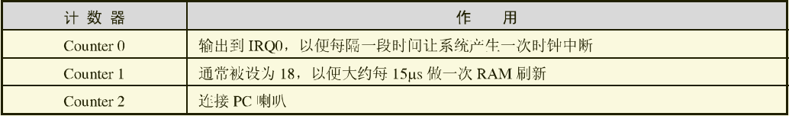
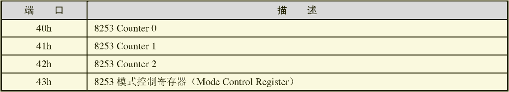
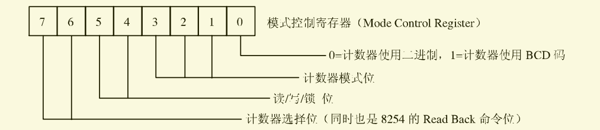
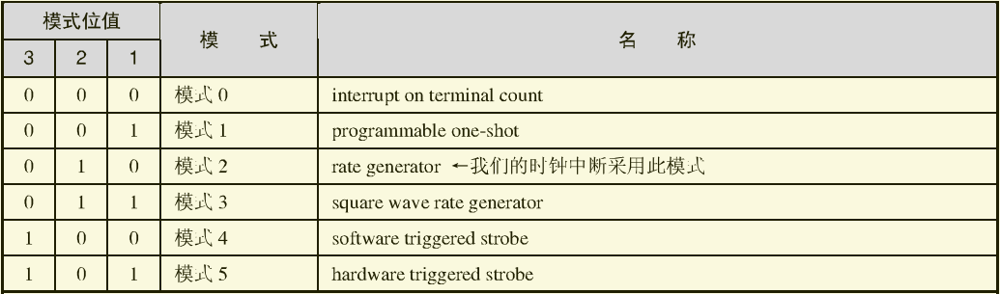
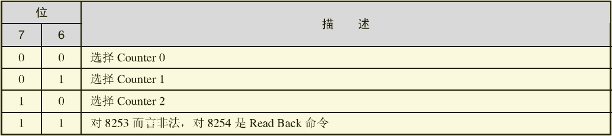

# 时钟中断处理

​	为了我们之后的多进程调度做准备，我们先来完成时钟的中断处理，它是中断驱动程序的一环，但是不完整，因为一个完整的驱动程序不仅仅是对硬件进行使用，还会提供很多功能，本期我们只是完成时钟中断的处理。

## 8253/8254 PIT(Programmable Interval Timer)

​	计算机的时钟可以在一段时间内产生一次时钟中断，这个中断当然不是凭空产生的。它由一个叫PIT(Programmable Interval Timer)的可编程间隔计时器芯片产生的，在XT计算机中使用的是Intel 8253，到了AT以后则被升级成了Intel 8254。8254功能更强一些，但我们所用的功能并涉及不到，以后都将统一称为8253。

​	首先8253它有3个计数器(Counter)，它们都是16位的，作用各不相同，如下图所示。



​	很明显，我们所说的时钟中断很明显是由Counter0产生的。

​	计数器工作原理：它有一个输入频率（PC上是1193180Hz），在每一个时钟周期，计数器值都会减1，当减为0时，就触发一个输出。前面说过计数器是16位的，所以它最大值是65535，默认是最大值，所以默认的时钟中断发生频率就是1193180/65535≈18Hz，也就是每s输出产生18次输出。

​	既然叫可编程间隔计时器芯片，那么我们自然可以通过编程来控制8253，只要我们更改计数器Counter 0的计数值，就可以改变中断产生的时间间隔了。

​	在这，Flyanx打算使用的时钟时间间隔是10ms，也就是让输出频率为100Hz(每秒输出100次输出)，那么可以算出计数器需要赋值为1193180/100≈11931。为什么选择10ms呢？因为1s=1000ms，应该选择一个可以被1000ms整除的值最好，便于以后计时和换算，1ms实在太短了想着也有点太费电，所以就选10ms就好了。

​	已经明白了原理，我们怎么做呢？还记得在我们曾经初始化过的8259A吗？没错，对于这些可编程的硬件，通通都是对相应端口的写操作来实现更改属性的。现在让我们来看一下8253的端口情况，如下图所示。



​	我们从上面图中一眼就能发现到重点，Counter 0对应的端口是40H，但是具体操作却不是这么简单的，官方要求我们需要先通过端口43H为8253选择一个模式，才能够对计数器进行下一步的操作。那我们马上看一下8253模式控制寄存器能接收的数据格式吧，如下图所示。



​	这个数据是一个8位1字节的数据，不算很难理解，接下来看一下其中最重要的计数器模式位可以接受的值吧，它如下图所示。



​	关于模式的选择，我们选择使用TINIX一样的rate generator，它可以在每个周期都产生一条中断，直到关机。

​	接下来看看读/写/锁位：


这里注意：锁(Latch)当前计数值并不是让计数停止下来，而仅仅是为了便于读取、相反的，如果不锁住直接读取可能会影响到计数值。

​	最后是计数器选择位：



​	哇，真的是很麻烦是不是，每一位的使用都这么讲究？但没关系，了解了所有部分之后，如何去设置我们想要的效果就很明确了。

​	1 首先，我们要操作的是Counter 0，所以7、6位应该是“00”，表示要设置Counter 0。

​	2 计数值是16位的，所以低字节和高字节都必须要写入，于是5、4位应该是“11”。

​	3  因为我们选择模式2，所以3、2、1为应该是“010”。

​	4 对于计数值，很明显我们使用二进制比较方便，第0位就设为“0”。

​	就这样，我们得出的整个字节就是“00-11-010-0”，也就是十六进制的0x34，我们将它定义成宏"RATE_GENERATOR"以便我们的使用。

​	硬件理论明白之后，马上编写初始化8253的代码吧！我们首先将以上分析推理的值定义成宏以便使用，在这直接将其贴出。

```c
/* 时钟, 8253 / 8254 PIT (可编程间隔定时器)参数 */
#define TIMER0          0x40	/* 定时器通道0的I/O端口 */
#define TIMER1          0x41	/* 定时器通道1的I/O端口 */
#define TIMER2          0x42	/* 定时器通道2的I/O端口 */
#define TIMER_MODE      0x43	/* 用于定时器模式控制的I/O端口 */
#define RATE_GENERATOR	    0x34	    /* 00-11-010-0
								         * Counter0 - LSB the MSB - rate generator - binary
								         */
#define TIMER_FREQ		    1193182L    /* clock frequency for timer in PC and AT */
#define TIMER_COUNT  (TIMER_FREQ / HZ)  /* initial value for counter*/
#define CLOCK_ACK_BIT	    0x80		/* PS/2 clock interrupt acknowledge bit */
```

​	有了这些值，我们马上可以编写我们的8253初始化了。

​	初始化工作做完，我们就可以编写一个例程专门来处理我们的时钟中断了，我们现在马上编写它，然后将它注册，注册完将其打开，然后我们就可以完成时钟驱动的初始化了。

​	


