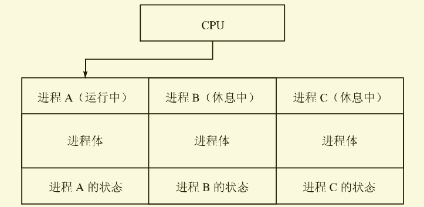

# 多进程框架

​	时间过得很快，我们要开始考虑多进程了，本节主题我称它为多进程框架，为什么用这个词呢？首先我们先来看看什么是进程？

​	关于这个问题，我并不想大作周章，因为如果从理论上说的话，教科书上进程的概念说的比任何人都要细，我就从软硬件两个方面简单概括一下我自己理解的进程。

​	软件：一个正在活动的应用程序，就是进程。举个例子：你正在使用QQ聊天，QQ这个程序现在就是一个进程。是的，就这么简单，但是如果要实现多进程，光是有软件方面的认识还是不够的。

​	硬件：一个编写好的程序，它包括了代码、数据，计算机将其装载入到内存中然后CPU开始逐行的执行程序代码，我们就可以称其为进程。而如果有许多这样的进程正在轮流被CPU调度执行，那么就形成了多进程。CPU调度这些进程的形式和方法，可以称之为进程调度算法。

​	进程好像很简单从上面的结论来看，但是现在有一个点是我们必须要注意的，那就是 CPU 同一时间只能执行一个进程（针对80386，对现在的真正多核心 CPU 并不适用），某一时间点只可能有一个进程正在执行，其他的进程处于暂停/休息状态，而当休息的进程再次被调度的时候，CPU必须要知道这个进程上次暂停后代码执行到哪一行，以及它当时数据的各种状态等等。很明显，我们必须有一种东西可以存储记录一个进程的状态信息，也就是进程数据结构。有了这个东西，进程就可以在暂停、运行的状态中任意切换而不会丢失状态了，如下图所示。

	

## 进程结构分析

​	现在的问题很明确了，我们该如何定义这个进程的数据结构呢？还好的是，Intel开发手册和前辈的代码给了我们答案，CPU执行一个进程至少要有以下的上下文信息：所有寄存器状态、当前进程代码执行到的地址以及该进程的 LDT(local desciptor table) 信息。这些信息也可称为PCB（Process Control Block进程控制块，它们跟硬件相关性很强。

​	在这，我们直接用 MINIX 所使用的栈帧结构，它包含了一个进程的所有寄存器状态以及进程代码位置信息。

```c
/* stackframe_s定义了如何将寄存器值保存到堆栈上的数据结构
 * 这个结构非常重要-在进程被投入运行状态或被脱开运行状态时,它被用来保
 * 存和恢复CPU的内部状态。将其定义成可以用汇编语言高速读写的格式,这将
 * 减少进程上下文切换的时间，进程指针必须指向这里。
 */
typedef struct stackframe_s {
    /* 低地址 */
    /* =========== 所有的特殊段寄存器，我们手动压入 =========== */
    reg_t	gs;
    reg_t	fs;
    reg_t	es;
    reg_t	ds;
    /* ============== 所有的普通寄存器，我们通过 pushad 手动压入 ============== */
    reg_t	edi;
    reg_t	esi;
    reg_t	ebp;
    reg_t	kernel_esp;	/* pushad 压入的 esp，这个时候已经自动从低特权级到了 0 特权级，
                         * 所以这个其实是从tss.esp0！而 popad 指令也会忽略这个，不会
                         * 恢复它。
                         */
    reg_t	ebx;
    reg_t	edx;
    reg_t	ecx;
    reg_t	eax;
    /* ======= call save()自动保存的返回地址 ======= */
    reg_t	ret_addr;
    /* ============ 中断自动压入的内容 ============= */
    reg_t	eip;        /* 中断门和调用门有一点点不同，那就是中断门还会压入一个eflags */
    reg_t	cs;
    reg_t	eflags;     /* 中断门自动压入 */
    reg_t	esp;
    reg_t   ss;
    /* =========================================== */
    /* 高地址 */
} Stackframe_t;
```

​	在这，我们先将它们放入到我们的工程中，之后我将会解释里面各个寄存器的位置，它们的排列不是随便排序的，它们是的排序是很重要的！

​	接下来我们马上建立我们的进程结构体，这些进程相关的信息被放在一个专门的头文件中：

```c
/* Copyright (C) 2007 Free Software Foundation, Inc. 
 * See the copyright notice in the file /usr/LICENSE.
 * Created by flyan on 2020/3/4.
 * QQ: 1341662010
 * QQ-Group:909830414
 * gitee: https://gitee.com/flyanh/
 *
 * Flyanx的进程相关头文件
 */

#ifndef _FLYANX_PROCESS_H
#define _FLYANX_PROCESS_H

/* 进程，一个进程是包含 进程的寄存器信息(栈帧) 和 LDT(本地描述符表) 以及 自定义的一些属性
 * CPU通过PCB来调度进程
 */
typedef struct process_s {
    /* ===================================================================================== */
    /* 这里存放 进程的寄存器信息(栈帧) 和 LDT(本地描述符表) 信息，它们由 CPU 使用并调度，和硬件相关 */
    Stackframe_t regs;          /* 进程的栈帧，包含进程自己所有寄存器的信息 */
    reg_t ldt_sel;              /* 进程的 LDT 选择子 */
    SegDescriptor_t ldt[2];     /* 进程的 LDT 的数据，长度2是 LDT_SIZE，它定义在文件 protect.h 中，
                                 * 直接给出就不用导入该头文件了 */
    /* ===================================================================================== */
    /* 从这后面都是用户自定义的属性，和硬件无关 */

    /* 堆栈保护字
     * 用于识别堆栈是否正常，如果被改变那么堆栈已经出现问题
     */
    reg_t* stack_guard_word;

    /* 进程的内存映像
     * 现在包括正文段和数据段（堆栈段），但只有一个而非一个数组，
     * 因为Flyanx当前版本并不加以细分这几个段，它们都使用同一个
     * 段区域，所以一个就可以描述了。
     */
    MemoryMap_t map;

    /* 调度相关 */
    /* flags 状态标志位图域中的标志位标识进程的状态。如果其中任一位被置位,则进程将被堵塞
     * 无法运行。各种标志被定义和描述请往下看，如果该进程表项未被使用,则P_SLOT_FREE被置位。
     */
    int flags;
    pid_t pid;                      /* 进程号，用户可见的 */
    u8_t priority;                  /* 权限：任务0/服务1/用户进程3 */
    struct process_s* next_ready;   /* 指向下一个就绪的进程，形成一个队列 */
    int logic_nr;                   /* 进程在进程表中的逻辑编号，主要用于表中的进程快速访问 */
    bool_t int_blocked;             /* 被置位，当目标进程有一条中断消息被繁忙的任务堵塞了 */
    bool_t int_held;                /* 被置位，当目标进程有一条中断消息被繁忙的系统调用挂起保留了 */
    struct process_s* next_held;    /* 被挂起保留的中断过程队列 */

    /* 时间相关 */
    clock_t user_time;              /* 用户时间(以时钟滴答为单位)，即进程自己使用的时间 */
    clock_t sys_time;               /* 系统时间(以时钟滴答为单位)，即进程调用了系统任务的时间，或者说进程本身就是系统任务 */
    clock_t child_user_time;        /* 子进程累积使用的用户时间 */
    clock_t child_sys_time;         /* 子进程累积使用的系统时间 */
    clock_t alarm;                  /* 进程下一次闹钟响起的时间 */

    /* 消息通信相关 */
    Message_t* inbox;               /* 收件箱，当有人发送消息过来将被邮局将消息放在这里，它是一个虚拟地址 */
    Message_t* outbox;              /* 发件箱，当一个进程发送消息给另一个进程，邮局将会从这里获取要发送的消息，
                                     * 同上它也是一个虚拟地址 */
    int get_form;                   /* 当一个进程执行接收操作，但没有发现有任何人想发消息过来时将会堵塞，然后将自己期望
                                     * 接收消息的进程逻辑编号保存在这 */
    int send_to;                    /* 同上，保存要发送消息给谁？ */
    struct process_s* next_waiter;  /* 指向下一个要发送消息给我的人，为了实现等待队列 */

    /* 信号相关 */
    sigset_t pending;               /* 挂起位图，用于记录那些尚未被传送到 MM 的信号(因为 MM 没有在等待一条消息) */
    size_t pend_count;              /* 有几个信号被挂起了？ */

    char name[32];                  /* 这个没啥好说的，就是进程的名称，记得起个好名字哦 */
} Process_t;

/* 系统堆栈的保护字 */
#define SYS_TASK_STACK_GUARD	((reg_t) (sizeof(reg_t) == 2 ? 0xBEEF : 0xDEADBEEF))    /* 任务的 */
#define SYS_SERVER_STACK_GUARD	((reg_t) (sizeof(reg_t) == 2 ? 0xBFEF : 0xDEADCEEF))    /* 服务的 */

/* flags 状态标志位图域中的标志位状态定义
 *
 * 现在一共有三种状态，只要任一状态位被置位，那么进程就会被堵塞
 */
#define CLEAN_MAP       0       /* 干净的状态，进程正在快乐的执行 */
#define NO_MAP		    0x01	/* 执行一个FORK操作后,如果子进程的内存映像尚未建立起来,那么NO_MAP将被置位以阻止子进程运行 */
#define SENDING		    0x02	/* 进程正在试图发送一条消息 */
#define RECEIVING	    0x04	/* 进程正在试图接收一条消息 */
#define PENDING         0x08    /* 进程有待处理的信号 */
#define SIG_PENDING     0x10    /* 一个信号即将到来，进程需要等待系统处理完成 */

/* 进程权限定义 */
#define PROC_PRI_NONE	0	/* 表示该进程插槽未使用 */
#define PROC_PRI_TASK	1	/* 部分内核，即系统任务 */
#define PROC_PRI_SERVER	2	/* 内核之外的系统服务 */
#define PROC_PRI_USER	3	/* 用户进程 */
#define PROC_PRI_IDLE	4	/* 空闲进程，一个特殊的进程，当系统没有正在活动的进程时被运行 */

/* 对过程表地址操作的一些宏定义。 */
#define BEG_PROC_ADDR       (&proc_table[0])
#define END_PROC_ADDR       (&proc_table[NR_TASKS + NR_SERVERS + NR_PROCS])
#define END_TASK_ADDR       (&proc_table[NR_TASKS])
#define BEG_SERVER_ADDR     (&proc_table[NR_TASKS + NR_SERVERS])
#define BEG_USER_PROC_ADDR  (&proc_table[NR_TASKS + NR_SERVERS +LOW_USER])

/* 下面的这些宏能帮助我们快速做一些进程判断等简单的工作 */
#define NIL_PROC          ((Process_t *) 0)       /* 空进程指针 */
#define logic_nr_2_index(n) (NR_TASKS + n)
#define is_idle_hardware(n) ((n) == IDLE_TASK || (n) == HARDWARE)   /* 是空闲进程 或 硬件（特殊进程）？ */
#define is_ok_proc_nr(n)      ((unsigned) ((n) + NR_TASKS) < NR_PROCS + NR_TASKS)   /* 是个合法的进程索引号？ */
#define is_ok_src_dest(n)   (is_ok_proc_nr(n) || (n) == ANY)                        /* 是个合法的发送或接收进程？ */
#define is_any_hardware(n)   ((n) == ANY || (n) == HARDWARE)                        /* 发送/接收进程是任何 或 硬件（特殊进程）？ */
#define is_sys_server(n)      ((n) == FS_PROC_NR || (n) == MM_PROC_NR || (n) == FLY_PROC_NR)      /* 是系统服务？ */
#define is_empty_proc(p)       ((p)->priority == PROC_PRI_NONE)             /* 是个空进程？ */
#define is_sys_proc(p)         ((p)->priority != PROC_PRI_USER)         /* 是个系统进程？ */
#define is_task_proc(p)        ((p)->priority == PROC_PRI_TASK)             /* 是个系统任务进程？ */
#define is_serv_proc(p)        ((p)->priority == PROC_PRI_SERVER)           /* 是个系统服务进程？ */
#define is_user_proc(p)        ((p)->priority == PROC_PRI_USER)             /* 是个用户进程？ */

/* 提供宏 proc_addr 是因为在C语言中下标不能为负数。在逻辑上,数组proc应从 -NR_TASKS到+NR_PROCS(因为用户进程从1开始)。
 * 但在C语言中下标必须从0开始,所以proc[0]指向进程表项下标最小的任务,其他也依次类推。为了更便于记录进程表项与
 * 进程之间的对应关系,我们可以使用
 * proc = proc_addr(n);
 * 将进程n的进程表项地址赋给rp,无论它是正还是负。
 */
#define proc_addr(n)      (p_proc_addr + NR_TASKS)[(n)]    /* 得到进程的指针 */
#define cproc_addr(n)     (&(proc_table + NR_TASKS)[(n)])  /* 得到进程的地址 */
/* 进程的虚拟地址转物理地址 */
#define proc_vir2phys(p, vir) \
    ((phys_bytes)(p)->map.base + (vir_bytes)(vir))

/* 进程表，记录系统的所有进程
 * 大小是
 */
EXTERN Process_t proc_table[NR_TASKS + NR_SERVERS + NR_PROCS];
EXTERN Process_t* p_proc_addr[NR_TASKS + NR_SERVERS + NR_PROCS]; /* 因为进程表的访问非常频繁,并且计算数组中的一个地址需要
                                                                  * 用到很慢的乘法操作, 所以使用一个指向进程表项的指针数组
                                                                  * p_proc_addr来加快操作速度。 */

/* bill_proc指向正在对其CPU使用计费的进程。当一个用户进程调用文件系统,而文件系统正在运行
 * 时,curr_proc(在global.h中)指向文件系统进程,但是bill_proc将指向发出该调用的用户进程。因为文件系统使用的
 * CPU时间被作为调用者的系统时间来计费。
 */
EXTERN Process_t* bill_proc;

/* 两个数组ready_head和ready_tail用来维护调度队列。例如,ready_head[TASK_Q]指向就绪任务队列中的第一个进程。
 * 就绪进程队列一共分为三个
 * ready_head[TASK_QUEUE]：就绪系统任务队列
 * ready_head[SERVER_QUEUE]：就绪服务进程队列
 * ready_head[USER_QUEUE]：就绪用户进程队列
 * 再举个例子，我们需要拿到用户进程队列的第3个进程，则应该这么拿：ready_head[USER_QUEUE]->next_ready->next_ready，简单吧？
 */
EXTERN Process_t* ready_head[NR_PROC_QUEUE];
EXTERN Process_t* ready_tail[NR_PROC_QUEUE];

#endif //_FLYANX_PROCESS_H

```

​	最后别忘了将该头文件在 table.c 中导入，以便编译时编译器能帮我们声明定义出里面 EXTERN 的变量，其中最重要的莫过于进程表了。

## 进程切换

​	现在我们大米有了，人人都说巧妇难为无米之炊，但现在大米就摆在我们面前，却有一个最大的难题：假如我们已经通过上面的信息初始化了很多个进程，那么我们怎么让它们执行起来呢？当第一个进程正在运行了，什么时候第二个进程能执行呢？

​	很明显，以上的问题无一不透漏着一个问题：动态切换。

​	还记得上一期我们完成的时钟中断吗？它刚刚好就是固定周期产生一次中断的，那么我们的进程就在时钟中断例程中进行切换如何？是的，我们马上开始改进我们的中断处理框架，因为之前我们的中断框架根本没有考虑到多进程的情况！而从一个进程切换到中断，中断怎么知道返回到哪个进程里？

​	进程是由它所有的寄存器信息以及LDT信息来唯一标识的，那么我们在进入中断的时候，需要对该进程的寄存器做一下简单的保存工作以便之后恢复。马上来改造吧，这里我们将揭晓之前那个栈帧结构的由来。

​	1	添加一个全局指针变量标识当前正在运行的进程curr_proc	

​	2 	编写一个进程开始函数，它完成第一个curr_proc指向的进程开始，并在之后每次进程切换时都调用恢复curr_proc指向的进程。这一步需要用到进程结构体中的 PCB 信息，而且需要用汇编完成任务，所以我们将这些它们在进程表中的偏移导入到汇编头文件中。最后还有一个 tss::sp0 的偏移，因为从进程切换到内核级会自动使用切换到这个 ss0:sp0。

```assembly
; Stackframe 栈帧结构中每个属性的偏移
P_STACKBASE     equ 0               ; 栈基地址
GSREG           equ P_STACKBASE     ; GS段寄存器
FSREG           equ GSREG + 4       ; ES段寄存器
ESREG           equ FSREG + 4       ; FS段寄存器
DSREG           equ ESREG + 4       ; DS段寄存器(数据段寄存器)
EDIREG          equ DSREG + 4       ; EDI寄存器
ESIREG          equ EDIREG + 4      ; ESI寄存器
EBPREG          equ ESIREG + 4      ; EBP寄存器
KERNELESPREG    equ EBPREG + 4      ; 内核ESP寄存器
EBXREG          equ KERNELESPREG + 4
EDXREG          equ EBXREG + 4
ECXREG          equ EDXREG + 4
EAXREG          equ ECXREG + 4
RETADDR         equ EAXREG + 4
PCREG           equ RETADDR + 4
CSREG           equ PCREG + 4
PWSREG          equ CSREG + 4
ESPREG          equ PWSREG + 4
SSREG           equ ESPREG + 4
P_STACKTOP      equ SSREG + 4       ; 栈顶
P_LDT_SEL       equ P_STACKTOP      ; LDT选择子
P_LDT           equ P_LDT_SEL + 4   ; LDT
; TSS::SP0 的偏移
TSS3_S_SP0      equ 4
```

​	3 	编写一个进程保存函数，在每次发生中断时及时将进程的所有栈帧信息保存到进程的结构体中。

​	4	改写中断处理例程，和我们的2、3步编写的函数联动起来，进入中断先保存进程状态，离开中断恢复当前正在执行的进程。


​	


​	


​	

​		


​	


