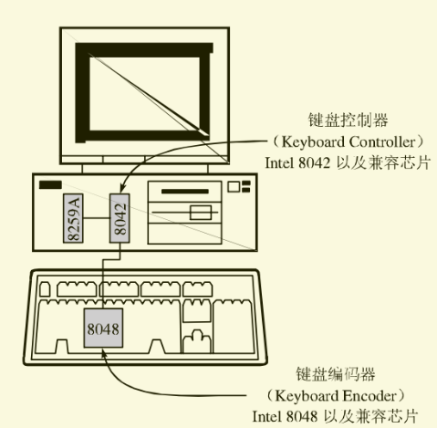

# 键盘驱动

​	如果说某一种代码是人和计算机进行交流的方言，那么键鼠则是用户和操作系统交流的方言。不管你的内核有多么炫酷的画面，键盘的交互是最基本的方式。

## 1 理论支持

​	我们现在开始为我们的内核考虑键盘驱动。首先我们先简单的了解一下键盘敲击的过程从更底层的角度。和其他某些设备一样，键盘内部有一枚叫做键盘编码器（Keyboard Encoder）的芯片，它通常是 **Intel 8048**，这枚芯片的作用是监控键盘的输入，并把适当的数据传输给计算机。

​	同时，计算机主板上还有一个键盘控制器Intel 8042（Keyboard Controller），用于接收和解码来自键盘的数据，并与我们最熟悉的中断产生者8259A以及其他软件通信，见图 1.1。

​	然而敲击键盘并不是按下就马上给系统一个ASCII码这么简单。敲击键盘会产生一种编码，被称之为扫描码(Scan Code)，它又分为Make Code和Break Code两类。当一个键盘被按下或保持按下时，将会产生一个Make Code，而当按键弹起时，产生一个Break Code。

但最糟糕的是扫描码总共有三套，分别是Scan Code Set 1~3。第一套是早期的 XT 键盘所使用的，现在的键盘默认都支持第二套，第三套很少被使用。

​	

​	我们现在具体解析下这个流程：当8048检测到一个按键发生动作时，将相应的键盘扫描码发送给8042，8042会将它转换成相应的第一套扫描码（为了兼容），并将其放置在自己的缓冲区中，然后8042告诉8259A产生一个中断(IRQ 1)。当缓冲区被读取清空时，8042才会继续响应。所以我们的目标是要知道如何读取8042缓冲区中的扫描码然后进行软件编程即可，所以，我们看一下8042包含的寄存器吧（见图1.2）。


​	从图中我们可以知道，只需要使用 in al, 0x60，即可将 8042 缓冲区的键盘扫描码读取到 al 寄存器中了，至于其他的寄存器我们在用到的时候再详细了解吧。

## 2 基本字符处理和显示

​	趁热，我们赶紧编写我们的驱动代码，本节我们的目标就是完成基本的字符处理和显示。我们首先倒入一些需要的两个头文件，它们分别是从 Minix 移植过来的美国键盘映射表，这种前辈做好的工作，我们就不必要造轮子。

```c
/* Copyright (C) 2007 Free Software Foundation, Inc.
 * See the copyright notice in the file /usr/LICENSE.
 * Created by flyan on 2020/3/11.
 * QQ: 1341662010
 * QQ-Group:909830414
 * gitee: https://gitee.com/flyanh/
 * include/flyanx/keymap.h
 * 
 * 定义了若干结构，它们用来实现不同语言所需的字符集对应的特效键盘布局。
 * 它也被那些生成和加载表格的程序使用。
 * 此文件参考自MINIX。
 */

#ifndef FLYANX_KEYMAP_H
#define FLYANX_KEYMAP_H

#define	C(c)	((c) & 0x1F)	/* Map to control code		*/
#define A(c)	((c) | 0x80)	/* Set eight bit (ALT)		*/
#define CA(c)	A(C(c))		/* Control-Alt			*/
#define	L(c)	((c) | HASCAPS)	/* Add "Caps Lock has effect" attribute */

#define EXT	0x0100		/* Normal function keys		*/
#define CTRL	0x0200		/* Control key			*/
#define SHIFT	0x0400		/* Shift key			*/
#define ALT	0x0800		/* Alternate key		*/
#define EXTKEY	0x1000		/* extended keycode		*/
#define HASCAPS	0x8000		/* Caps Lock has effect ：大写锁定生效 */

/* Numeric keypad */
#define PAD_SLASH	0x35	        /* /		*/
#define PAD_STAR	0x37	        /* *		*/
#define PAD_MINUS	(0x0A + EXT)	/* -		*/
#define PAD_PLUS	(0x0B + EXT)	/* +		*/
#define PAD_ENTER	0x54	        /* Enter	*/
#define PAD_DOT		(0x31 + EXT)	/* .		*/
#define PAD_0		(0x32 + EXT)	/* 0		*/
#define PAD_1		(0x33 + EXT)	/* 1		*/
#define PAD_2		(0x34 + EXT)	/* 2		*/
#define PAD_3		(0x35 + EXT)	/* 3		*/
#define PAD_4		(0x36 + EXT)	/* 4		*/
#define PAD_5		(0x37 + EXT)	/* 5		*/
#define PAD_6		(0x38 + EXT)	/* 6		*/
#define PAD_7		(0x39 + EXT)	/* 7		*/
#define PAD_8		(0x3A + EXT)	/* 8		*/
#define PAD_9		(0x3B + EXT)	/* 9		*/
#define HOME	(0x01 + EXT)
#define END	(0x02 + EXT)
#define UP	(0x03 + EXT)
#define DOWN	(0x04 + EXT)
#define LEFT	(0x05 + EXT)
#define RIGHT	(0x06 + EXT)
#define PGUP	(0x07 + EXT)
#define PGDN	(0x08 + EXT)
#define MID	(0x09 + EXT)
#define NMIN	(0x0A + EXT)
#define PLUS	(0x0B + EXT)
#define INSERT	(0x0C + EXT)

/* Alt + Numeric keypad */
#define AHOME	(0x01 + ALT)
#define AEND	(0x02 + ALT)
#define AUP	(0x03 + ALT)
#define ADOWN	(0x04 + ALT)
#define ALEFT	(0x05 + ALT)
#define ARIGHT	(0x06 + ALT)
#define APGUP	(0x07 + ALT)
#define APGDN	(0x08 + ALT)
#define AMID	(0x09 + ALT)
#define ANMIN	(0x0A + ALT)
#define APLUS	(0x0B + ALT)
#define AINSRT	(0x0C + ALT)

/* Ctrl + Numeric keypad */
#define CHOME	(0x01 + CTRL)
#define CEND	(0x02 + CTRL)
#define CUP	(0x03 + CTRL)
#define CDOWN	(0x04 + CTRL)
#define CLEFT	(0x05 + CTRL)
#define CRIGHT	(0x06 + CTRL)
#define CPGUP	(0x07 + CTRL)
#define CPGDN	(0x08 + CTRL)
#define CMID	(0x09 + CTRL)
#define CNMIN	(0x0A + CTRL)
#define CPLUS	(0x0B + CTRL)
#define CINSRT	(0x0C + CTRL)

/* 锁定键 */
#define CALOCK	(0x0D + EXT)	/* 大写锁定	*/
#define	NLOCK	(0x0E + EXT)	/* 数字锁定	*/
#define SLOCK	(0x0F + EXT)	/* 滚动锁定	*/

/* Function keys */
#define F1	(0x10 + EXT)
#define F2	(0x11 + EXT)
#define F3	(0x12 + EXT)
#define F4	(0x13 + EXT)
#define F5	(0x14 + EXT)
#define F6	(0x15 + EXT)
#define F7	(0x16 + EXT)
#define F8	(0x17 + EXT)
#define F9	(0x18 + EXT)
#define F10	(0x19 + EXT)
#define F11	(0x1A + EXT)
#define F12	(0x1B + EXT)

/* Alt+Fn */
#define AF1	(0x10 + ALT)
#define AF2	(0x11 + ALT)
#define AF3	(0x12 + ALT)
#define AF4	(0x13 + ALT)
#define AF5	(0x14 + ALT)
#define AF6	(0x15 + ALT)
#define AF7	(0x16 + ALT)
#define AF8	(0x17 + ALT)
#define AF9	(0x18 + ALT)
#define AF10	(0x19 + ALT)
#define AF11	(0x1A + ALT)
#define AF12	(0x1B + ALT)

/* Ctrl+Fn */
#define CF1	(0x10 + CTRL)
#define CF2	(0x11 + CTRL)
#define CF3	(0x12 + CTRL)
#define CF4	(0x13 + CTRL)
#define CF5	(0x14 + CTRL)
#define CF6	(0x15 + CTRL)
#define CF7	(0x16 + CTRL)
#define CF8	(0x17 + CTRL)
#define CF9	(0x18 + CTRL)
#define CF10	(0x19 + CTRL)
#define CF11	(0x1A + CTRL)
#define CF12	(0x1B + CTRL)

/* Shift+Fn */
#define SF1	(0x10 + SHIFT)
#define SF2	(0x11 + SHIFT)
#define SF3	(0x12 + SHIFT)
#define SF4	(0x13 + SHIFT)
#define SF5	(0x14 + SHIFT)
#define SF6	(0x15 + SHIFT)
#define SF7	(0x16 + SHIFT)
#define SF8	(0x17 + SHIFT)
#define SF9	(0x18 + SHIFT)
#define SF10	(0x19 + SHIFT)
#define SF11	(0x1A + SHIFT)
#define SF12	(0x1B + SHIFT)

/* Alt+Shift+Fn */
#define ASF1	(0x10 + ALT + SHIFT)
#define ASF2	(0x11 + ALT + SHIFT)
#define ASF3	(0x12 + ALT + SHIFT)
#define ASF4	(0x13 + ALT + SHIFT)
#define ASF5	(0x14 + ALT + SHIFT)
#define ASF6	(0x15 + ALT + SHIFT)
#define ASF7	(0x16 + ALT + SHIFT)
#define ASF8	(0x17 + ALT + SHIFT)
#define ASF9	(0x18 + ALT + SHIFT)
#define ASF10	(0x19 + ALT + SHIFT)
#define ASF11	(0x1A + ALT + SHIFT)
#define ASF12	(0x1B + ALT + SHIFT)

#define MAP_COLS	    6	    /* 映射表的列数，列数越多，按键组合越多  */
#define NR_SCAN_CODES	0x80	/* 键盘扫描码数量，也是映射表的行数 */

typedef u16_t Keymap_t[NR_SCAN_CODES * MAP_COLS];   /* 键码映射表类型 */

#endif //FLYANX_KEYMAP_H

```

```
/* src/kernel/keymaps/us-std.h
 * 美国MF-2键盘的键盘映射
 */

static Keymap_t keymap = {

/* scan-code		!Shift	Shift	Alt1	Alt2	Alt+Sh	Ctrl	*/
/* ==================================================================== */
/* 00 - none	*/	0,	0,	0,	0,	0,	0,
/* 01 - ESC	*/	C('['),	C('['),	CA('['),CA('['),CA('['),C('['),
/* 02 - '1'	*/	'1',	'!',	A('1'),	A('1'),	A('!'),	C('A'),
/* 03 - '2'	*/	'2',	'@',	A('2'),	A('2'),	A('@'),	C('@'),
/* 04 - '3'	*/	'3',	'#',	A('3'),	A('3'),	A('#'),	C('C'),
/* 05 - '4'	*/	'4',	'$',	A('4'),	A('4'),	A('$'),	C('D'),
/* 06 - '5'	*/	'5',	'%',	A('5'),	A('5'),	A('%'),	C('E'),
/* 07 - '6'	*/	'6',	'^',	A('6'),	A('6'),	A('^'),	C('^'),
/* 08 - '7'	*/	'7',	'&',	A('7'),	A('7'),	A('&'),	C('G'),
/* 09 - '8'	*/	'8',	'*',	A('8'),	A('8'),	A('*'),	C('H'),
/* 10 - '9'	*/	'9',	'(',	A('9'),	A('9'),	A('('),	C('I'),
/* 11 - '0'	*/	'0',	')',	A('0'),	A('0'),	A(')'),	C('@'),
/* 12 - '-'	*/	'-',	'_',	A('-'),	A('-'),	A('_'),	C('_'),
/* 13 - '='	*/	'=',	'+',	A('='),	A('='),	A('+'),	C('@'),
/* 14 - BS	*/	C('H'),	C('H'),	CA('H'),CA('H'),CA('H'),0177,
/* 15 - TAB	*/	C('I'),	C('I'),	CA('I'),CA('I'),CA('I'),C('I'),
/* 16 - 'q'	*/	L('q'),	'Q',	A('q'),	A('q'),	A('Q'),	C('Q'),
/* 17 - 'w'	*/	L('w'),	'W',	A('w'),	A('w'),	A('W'),	C('W'),
/* 18 - 'e'	*/	L('e'),	'E',	A('e'),	A('e'),	A('E'),	C('E'),
/* 19 - 'r'	*/	L('r'),	'R',	A('r'),	A('r'),	A('R'),	C('R'),
/* 20 - 't'	*/	L('t'),	'T',	A('t'),	A('t'),	A('T'),	C('T'),
/* 21 - 'y'	*/	L('y'),	'Y',	A('y'),	A('y'),	A('Y'),	C('Y'),
/* 22 - 'u'	*/	L('u'),	'U',	A('u'),	A('u'),	A('U'),	C('U'),
/* 23 - 'i'	*/	L('i'),	'I',	A('i'),	A('i'),	A('I'),	C('I'),
/* 24 - 'o'	*/	L('o'),	'O',	A('o'),	A('o'),	A('O'),	C('O'),
/* 25 - 'p'	*/	L('p'),	'P',	A('p'),	A('p'),	A('P'),	C('P'),
/* 26 - '['	*/	'[',	'{',	A('['),	A('['),	A('{'),	C('['),
/* 27 - ']'	*/	']',	'}',	A(']'),	A(']'),	A('}'),	C(']'),
/* 28 - CR/LF	*/	C('M'),	C('M'),	CA('M'),CA('M'),CA('M'),C('J'),
/* 29 - Ctrl	*/	CTRL,	CTRL,	CTRL,	CTRL,	CTRL,	CTRL,
/* 30 - 'a'	*/	L('a'),	'A',	A('a'),	A('a'),	A('A'),	C('A'),
/* 31 - 's'	*/	L('s'),	'S',	A('s'),	A('s'),	A('S'),	C('S'),
/* 32 - 'd'	*/	L('d'),	'D',	A('d'),	A('d'),	A('D'),	C('D'),
/* 33 - 'f'	*/	L('f'),	'F',	A('f'),	A('f'),	A('F'),	C('F'),
/* 34 - 'g'	*/	L('g'),	'G',	A('g'),	A('g'),	A('G'),	C('G'),
/* 35 - 'h'	*/	L('h'),	'H',	A('h'),	A('h'),	A('H'),	C('H'),
/* 36 - 'j'	*/	L('j'),	'J',	A('j'),	A('j'),	A('J'),	C('J'),
/* 37 - 'k'	*/	L('k'),	'K',	A('k'),	A('k'),	A('K'),	C('K'),
/* 38 - 'l'	*/	L('l'),	'L',	A('l'),	A('l'),	A('L'),	C('L'),
/* 39 - ';'	*/	';',	':',	A(';'),	A(';'),	A(':'),	C('@'),
/* 40 - '\''	*/	'\'',	'"',	A('\''),A('\''),A('"'),	C('@'),
/* 41 - '`'	*/	'`',	'~',	A('`'),	A('`'),	A('~'),	C('@'),
/* 42 - l. SHIFT*/	SHIFT,	SHIFT,	SHIFT,	SHIFT,	SHIFT,	SHIFT,
/* 43 - '\\'	*/	'\\',	'|',	A('\\'),A('\\'),A('|'),	C('\\'),
/* 44 - 'z'	*/	L('z'),	'Z',	A('z'),	A('z'),	A('Z'),	C('Z'),
/* 45 - 'x'	*/	L('x'),	'X',	A('x'),	A('x'),	A('X'),	C('X'),
/* 46 - 'c'	*/	L('c'),	'C',	A('c'),	A('c'),	A('C'),	C('C'),
/* 47 - 'v'	*/	L('v'),	'V',	A('v'),	A('v'),	A('V'),	C('V'),
/* 48 - 'b'	*/	L('b'),	'B',	A('b'),	A('b'),	A('B'),	C('B'),
/* 49 - 'n'	*/	L('n'),	'N',	A('n'),	A('n'),	A('N'),	C('N'),
/* 50 - 'm'	*/	L('m'),	'M',	A('m'),	A('m'),	A('M'),	C('M'),
/* 51 - ','	*/	',',	'<',	A(','),	A(','),	A('<'),	C('@'),
/* 52 - '.'	*/	'.',	'>',	A('.'),	A('.'),	A('>'),	C('@'),
/* 53 - '/'	*/	'/',	'?',	A('/'),	A('/'),	A('?'),	C('@'),
/* 54 - r. SHIFT*/	SHIFT,	SHIFT,	SHIFT,	SHIFT,	SHIFT,	SHIFT,
/* 55 - '*'	*/	'*',	'*',	A('*'),	A('*'),	A('*'),	C('@'),
/* 56 - ALT	*/	ALT,	ALT,	ALT,	ALT,	ALT,	ALT,
/* 57 - ' '	*/	' ',	' ',	A(' '),	A(' '),	A(' '),	C('@'),
/* 58 - CapsLck	*/	CALOCK,	CALOCK,	CALOCK,	CALOCK,	CALOCK,	CALOCK,
/* 59 - F1	*/	F1,	SF1,	AF1,	AF1,	ASF1,	CF1,
/* 60 - F2	*/	F2,	SF2,	AF2,	AF2,	ASF2,	CF2,
/* 61 - F3	*/	F3,	SF3,	AF3,	AF3,	ASF3,	CF3,
/* 62 - F4	*/	F4,	SF4,	AF4,	AF4,	ASF4,	CF4,
/* 63 - F5	*/	F5,	SF5,	AF5,	AF5,	ASF5,	CF5,
/* 64 - F6	*/	F6,	SF6,	AF6,	AF6,	ASF6,	CF6,
/* 65 - F7	*/	F7,	SF7,	AF7,	AF7,	ASF7,	CF7,
/* 66 - F8	*/	F8,	SF8,	AF8,	AF8,	ASF8,	CF8,
/* 67 - F9	*/	F9,	SF9,	AF9,	AF9,	ASF9,	CF9,
/* 68 - F10	*/	F10,	SF10,	AF10,	AF10,	ASF10,	CF10,
/* 69 - NumLock	*/	NLOCK,	NLOCK,	NLOCK,	NLOCK,	NLOCK,	NLOCK,
/* 70 - ScrLock */	SLOCK,	SLOCK,	SLOCK,	SLOCK,	SLOCK,	SLOCK,
/* 71 - Home	*/	HOME,	'7',	AHOME,	AHOME,	A('7'),	CHOME,
/* 72 - CurUp	*/	UP, 	'8',	AUP,	AUP,	A('8'),	CUP,
/* 73 - PgUp	*/	PGUP,	'9',	APGUP,	APGUP,	A('9'),	CPGUP,
/* 74 - '-'	*/  	NMIN,	'-',	ANMIN,	ANMIN,	A('-'),	CNMIN,
/* 75 - Left	*/	LEFT,	'4',	ALEFT,	ALEFT,	A('4'),	CLEFT,
/* 76 - MID	*/  	MID,	'5',	AMID,	AMID,	A('5'),	CMID,
/* 77 - Right	*/	RIGHT,	'6',	ARIGHT,	ARIGHT,	A('6'),	CRIGHT,
/* 78 - '+'	*/  	PLUS,	'+',	APLUS,	APLUS,	A('+'),	CPLUS,
/* 79 - End	*/  	END,	'1',	AEND,	AEND,	A('1'),	CEND,
/* 80 - Down	*/	DOWN,	'2',	ADOWN,	ADOWN,	A('2'),	CDOWN,
/* 81 - PgDown	*/	PGDN,	'3',	APGDN,	APGDN,	A('3'),	CPGDN,
/* 82 - Insert	*/	INSERT,	'0',	AINSRT,	AINSRT,	A('0'),	CINSRT,
/* 83 - Delete	*/	0177,	'.',	A(0177),A(0177),A('.'),	0177,
/* 84 - Enter	*/	C('M'),	C('M'),	CA('M'),CA('M'),CA('M'),C('J'),
/* 85 - ???	*/	0,	0,	0,	0,	0,	0,
/* 86 - ???	*/	'<',	'>',	A('<'),	A('|'),	A('>'),	C('@'),
/* 87 - F11	*/	F11,	SF11,	AF11,	AF11,	ASF11,	CF11,
/* 88 - F12	*/	F12,	SF12,	AF12,	AF12,	ASF12,	CF12,
/* 89 - ???	*/	0,	0,	0,	0,	0,	0,
/* 90 - ???	*/	0,	0,	0,	0,	0,	0,
/* 91 - ???	*/	0,	0,	0,	0,	0,	0,
/* 92 - ???	*/	0,	0,	0,	0,	0,	0,
/* 93 - ???	*/	0,	0,	0,	0,	0,	0,
/* 94 - ???	*/	0,	0,	0,	0,	0,	0,
/* 95 - ???	*/	0,	0,	0,	0,	0,	0,
/* 96 - EXT_KEY	*/	EXTKEY,	EXTKEY,	EXTKEY,	EXTKEY,	EXTKEY,	EXTKEY,
/* 97 - ???	*/	0,	0,	0,	0,	0,	0,
/* 98 - ???	*/	0,	0,	0,	0,	0,	0,
/* 99 - ???	*/	0,	0,	0,	0,	0,	0,
/*100 - ???	*/	0,	0,	0,	0,	0,	0,
/*101 - ???	*/	0,	0,	0,	0,	0,	0,
/*102 - ???	*/	0,	0,	0,	0,	0,	0,
/*103 - ???	*/	0,	0,	0,	0,	0,	0,
/*104 - ???	*/	0,	0,	0,	0,	0,	0,
/*105 - ???	*/	0,	0,	0,	0,	0,	0,
/*106 - ???	*/	0,	0,	0,	0,	0,	0,
/*107 - ???	*/	0,	0,	0,	0,	0,	0,
/*108 - ???	*/	0,	0,	0,	0,	0,	0,
/*109 - ???	*/	0,	0,	0,	0,	0,	0,
/*110 - ???	*/	0,	0,	0,	0,	0,	0,
/*111 - ???	*/	0,	0,	0,	0,	0,	0,
/*112 - ???	*/	0,	0,	0,	0,	0,	0,
/*113 - ???	*/	0,	0,	0,	0,	0,	0,
/*114 - ???	*/	0,	0,	0,	0,	0,	0,
/*115 - ???	*/	0,	0,	0,	0,	0,	0,
/*116 - ???	*/	0,	0,	0,	0,	0,	0,
/*117 - ???	*/	0,	0,	0,	0,	0,	0,
/*118 - ???	*/	0,	0,	0,	0,	0,	0,
/*119 - ???	*/	0,	0,	0,	0,	0,	0,
/*120 - ???	*/	0,	0,	0,	0,	0,	0,
/*121 - ???	*/	0,	0,	0,	0,	0,	0,
/*122 - ???	*/	0,	0,	0,	0,	0,	0,
/*123 - ???	*/	0,	0,	0,	0,	0,	0,
/*124 - ???	*/	0,	0,	0,	0,	0,	0,
/*125 - ???	*/	0,	0,	0,	0,	0,	0,
/*126 - ???	*/	0,	0,	0,	0,	0,	0,
/*127 - ???	*/	0,	0,	0,	0,	0,	0

};

```

​	还有有关键盘端口相关的一些宏定义还有状态变量，我们也提前导入。

```c
/* 标准键盘和AT键盘 */
#define KEYBOARD_DATA       0x60    /* 键盘数据的I/O端口，用于和键盘控制器的底层交互。 */

/* AT键盘 */
#define KEYBOARD_COMMAND    0x64    /* AT上的命令I/o端口 */
#define KEYBOARD_STATUS     0x64    /* AT上的状态I/O端口 */
#define KEYBOARD_ACK        0xFA    /* 键盘相应确认 */

#define KEYBOARD_OUT_FULL   0x01    /* 字符按键按下时该状态位被设置 */
#define KEYBOARD_IN_FULL    0x02    /* 未准备接收字符时该状态位被设置 */
#define LED_CODE            0xED    /* 设置键盘灯的命令 */
#define MAX_KEYBOARD_ACK_RETRIES    0x1000  /* 等待键盘响应的最大等待时间 */
#define MAX_KEYBOARD_BUSY_RETRIES   0x1000  /* 键盘忙时循环的最大时间 */
#define KEY_BIT             0x80    /* 将字符打包传输到键盘的位 */

/* 它们用于滚屏操作 */
#define SCROLL_UP       0	            /* 前滚，用于滚动屏幕 */
#define SCROLL_DOWN     1	            /* 后滚 */

/* 锁定键激活位，应该要等于键盘上的LED灯位 */
#define SCROLL_LOCK	    0x01    /* 二进制：0001 */
#define NUM_LOCK	    0x02    /* 二进制：0010 */
#define CAPS_LOCK	    0x04    /* 二进制：0100 */
#define DEFAULT_LOCK    0x02    /* 默认：小键盘也是打开的 */

/* 键盘缓冲区 */
#define KEYBOARD_IN_BYTES	  32	/* 键盘输入缓冲区的大小 */

/* 其他用途 */
#define ESC_SCAN	        0x01	/* 重启键，当宕机时可用 */
#define SLASH_SCAN	        0x35	/* 识别小键盘区的斜杠 */
#define RSHIFT_SCAN	        0x36	/* 区分左移和右移 */
#define HOME_SCAN	        0x47	/* 数字键盘上的第一个按键 */
#define INS_SCAN	        0x52	/* INS键，为了使用 CTRL-ALT-INS 重启快捷键 */
#define DEL_SCAN	        0x53	/* DEL键，为了使用 CTRL-ALT-DEL 重启快捷键 */

/* 当前键盘所处的各种状态，解释一个按键需要使用这些状态 */
PRIVATE bool_t esc = FALSE;		            /* 是一个转义扫描码？收到一个转义扫描码时，被置位 */
PRIVATE bool_t alt_left = FALSE;		    /* 左ALT键状态 */
PRIVATE bool_t alt_right = FALSE;		    /* 右ALT键状态 */
PRIVATE bool_t alt = FALSE;		            /* ALT键状态，不分左右 */
PRIVATE bool_t ctrl_left = FALSE;		    /* 左CTRL键状态 */
PRIVATE bool_t ctrl_right = FALSE;		    /* 右CTRL键状态 */
PRIVATE bool_t ctrl = FALSE;		        /* CTRL键状态，不分左右 */
PRIVATE bool_t shift_left = FALSE;		    /* 左SHIFT键状态 */
PRIVATE bool_t shift_right = FALSE;         /* 右SHIFT键状态 */
PRIVATE bool_t shift = FALSE;		        /* SHIFT键状态，不分左右 */
PRIVATE bool_t num_down = FALSE;		    /* 数字锁定键(数字小键盘锁定键)按下 */
PRIVATE bool_t caps_down = FALSE;		    /* 大写锁定键按下 */
PRIVATE bool_t scroll_down = FALSE;	        /* 滚动锁定键按下 */
PRIVATE u8_t locks[NR_CONSOLES] = {         /* 每个控制台的锁定键状态 */
        DEFAULT_LOCK, DEFAULT_LOCK, DEFAULT_LOCK
};


/* 数字键盘的转义字符映射 */
PRIVATE char numpad_map[] =
        {'H', 'Y', 'A', 'B', 'D', 'C', 'V', 'U', 'G', 'S', 'T', '@'};
```


